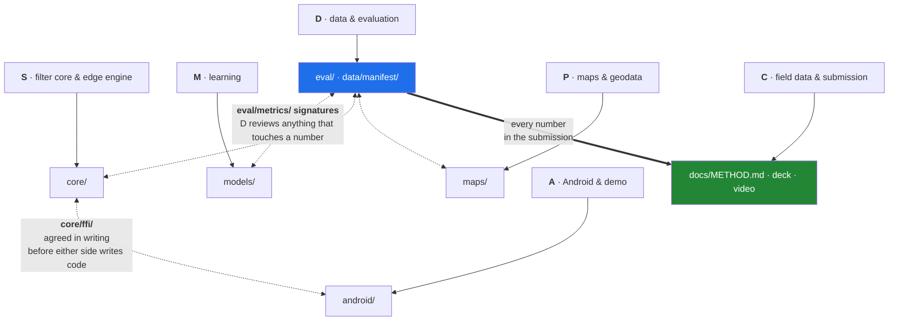

# AGENTS.md — PS 26168 Intelligent Dead Reckoning

Context file for any agent or teammate working on this project. Read this before touching code.
Full plan as a shareable page: https://claude.ai/code/artifact/59779151-0d41-49c9-b208-4a2c6798df5e

**Project:** Smart India Hackathon 2026, Problem Statement 26168 — AI-based intelligent dead reckoning for GNSS-denied ground-vehicle navigation.
**Nearest deadline:** screening submission, **Tue 8 Sep 2026** (corrected 26 Aug — see DECISION_LOG D-021).
**Grade metric:** position drift under 10% of distance travelled.

> **Read this before planning anything from this file.** The authoritative plan and calendar is
> [docs/IMPLEMENTATION_PLAN.md](docs/IMPLEMENTATION_PLAN.md); the current state is the
> [README](README.md) status block. As at **5 Sep, 3 days out: Gate 0 is not closed and Gate 1 is
> blocked** on filter consistency (D-053). Sections below marked ⚠️ have been overtaken by
> decisions in [docs/DECISION_LOG.md](docs/DECISION_LOG.md) and are kept for the record.

Derived from the two source docs in this folder: the AI/ML dead-reckoning engineering survey (markdown) and the condensed research brief (PDF).

---

## Thesis

One continuously-running error-state Invariant EKF on SE₂(3). IMU always propagates; GNSS is an optional χ²-gated correction. No second system, no handoff → "seamless transition within milliseconds" is satisfied by construction. Teams that build two systems show a position jump on every tunnel entry.

Three inputs the filter can't get wrong quietly:

1. Learned forward-speed head (never double-integrate accel — 10 mg ≈ 176 m in 60 s).
2. Kinematic constraints: NHC (no sideways/vertical velocity), ZUPT + ZARU at stops.
3. HMM map matching over an offline OSM graph, emission σ driven by filter covariance.

**Dominant error term is yaw**, not speed. Lateral error ≈ ½·b_g·v·t² — unbounded and sideways, and bad heading makes map matching snap onto the wrong road. Instrument yaw error at every step.

---

## Six seats

| Tag | Role | Scope |
|---|---|---|
| S | Filter core & edge engine (Sushant) | C++/Rust InEKF, NHC/ZUPT/ZARU, mounting angle, JNI; becomes the 200 Hz FOG edge build |
| M | Learning | Speed+variance head, AI-IMU adaptive R_NHC CNN, comma2k19 pretraining, FP16 export |
| D | Data & evaluation | IO-VNBD loader, outage harness, metrics, leakage audit, all plots |
| P | Maps & geodata | OSM → CSR graph, online HMM matcher, car-park fallback |
| A | Android | Foreground logger, uncalibrated sensors, timestamp alignment, demo UI |
| C | Field data & submission | Delhi/NCR collection, domain-shift ablation, write-up, deck, video |

---

## Sprints

> **STALE — superseded 26 Aug 2026 by docs/SPRINT_BOARD.md, and again 27 Aug 2026 by
> [docs/IMPLEMENTATION_PLAN.md](docs/IMPLEMENTATION_PLAN.md), which is now authoritative.**
> The real cut-off is Tue 8 Sep, not 20 Sep. The calendar below places Sprints 2 and 3
> *after* the actual deadline. Kept for the record; do not plan from it. (DECISION_LOG D-021.)

- **Sprint 0 · 26–30 Aug** — IO-VNBD `S-` parsing, outage harness, metric functions, repo/CI. Route scouting.
  *Gate 0: harness reproduces to the digit across two machines.*
- **Sprint 1 · 31 Aug–6 Sep** — Reproduce Onyekpe INS baseline (1 s window, MAE, Adamax 7e-4, batch 128, dropout 0.05, ~72-unit RNN). Stand up InEKF with **no learning**, process noise from an Allan-variance run.
  *Gate 1: physics-only within 3–5× of GNSS-available baseline over 60 s outages. Do not add a network before this clears.*
- **Sprint 2 · 7–13 Sep** — TCN/1D-ResNet speed+variance head, fused as a pseudo-measurement with predicted R. OSM extract begins. First Delhi collection.
  *Gate 2: ≥95% of speed errors inside ±2σ.*
- **Sprint 3 · 14–20 Sep** — AI-IMU adaptive R_NHC (~6k params, Adam 1e-4). R_sv in filter state + bump detector. Full eval sweep, all plots, write-up, deck, video.
  *Gate 3: submission.*
- **Buffer · 21–27 Sep** — Absorbs slippage; otherwise online HMM matcher + Android/JNI wiring.

---

## Evaluation protocol — fix before any model trains

> **This section is a summary. [docs/EVALUATION.md](docs/EVALUATION.md) is the protocol**, and two
> lines below have already been corrected there: the GNSS is 9 s rather than 1 Hz, and six of the
> sequence stems named here have no `S-` file at all. Read the protocol before quoting either.

- `S-` smartphone channels **ONLY**. `V-` wheel-speed columns are disallowed by the problem statement; assert this in the dataloader with a CI test that fails on any `V-` column name. One narrow exception, ground truth only: EVALUATION.md §1.2.
- 10 Hz inertial, NED frame, yaw-only 2-D, Vincenty ground-truth displacement. ⚠️ The `S-` **GNSS** is a measured **9.0 s**, not 1 Hz — EVALUATION.md §1.1.
- Outages: 10 / 30 / 60 / 120 / 180 s, non-overlapping, on held-out scenarios, 1 s prediction cadence.
- ⚠️ **Stale as written (D-044).** Eleven stems, `St6` and `St7` among them, ship on the `V-` stream only and are unusable. The loadable split lives in [`eval/splits.py`](eval/splits.py): long outage `S3a, Vtb3, Vta1a`; mandatory plots `S3a, Vta11`. The re-pick is still open.
- Metrics: CTE (cumulative true error) + CRSE (cumulative root square error) — their definitions, **not** cross-track error or ATE — plus drift as % of distance, which is what PS 26168 grades.
- Yaw error logged separately, always.
- Every plot and table is stamped with the commit and seed that produced it.

---

## Top risks

1. **Yaw drift eats the budget** → ZARU at every detected stop, bias snapshot at tunnel entry, magnetometer as a weak prior only (cabin ferromagnetics), map-matching heading feedback as the outer loop.
2. **Wheel-speed leakage** → column allowlist + CI test; audited in Sprint 1 and again before submission.
3. **Gate 1 fails and networks get stacked on a broken spine** → hard stop. Diagnose in order: timestamps → NHC gating conditions → process noise → ZUPT thresholds.
4. **Overconfident covariance head** → calibration check at Gate 2. Ship FP16; INT8 only with a covariance-head degradation test, since a mis-scaled covariance corrupts a Kalman filter worse than a noisy mean.
5. **Car park has no road graph** → tight NHC + barometer floor detection (a level ≈ 2.5–3 m ≈ 0.3–0.36 hPa) + ramp detection from sustained pitch. State the limitation honestly rather than overclaiming.
6. **Android sensor reality** → declare `HIGH_SAMPLING_RATE_SENSORS` (200 Hz cap since API 31), run a foreground service (no background sensor events since Android 9), use `*_UNCALIBRATED` types so the OS bias estimate stays separate from the filter's, never assume a nominal Δt.
7. **NavIC assumed usable** → often filtered out by low-level drivers even where the chipset supports it, and Android's GNSS API lacks standard identifiers. Treat as bonus; rely on GPS + GLONASS + Galileo + BeiDou.

---

## Cut list, in order

⚠️ **Superseded by [docs/IMPLEMENTATION_PLAN.md](docs/IMPLEMENTATION_PLAN.md) §5.** The items below
are already cut, not candidates: map matching, the Android app, car-park mode, comma2k19 pretraining
and the C++/Rust port are all deferred past screening. The live cut list is **adaptive `R_NHC` →
in-filter `R_sv` → replay-renderer polish → the renderer entirely.**

*(Historical: UI polish → EqNIO equivariant canonicalisation → car-park mode → comma2k19 pretraining.)*

**Never cut:** the evaluation harness, the leakage audit, the yaw instrument, the honest-limits section of the write-up.

---

## Citation hygiene

AI-IMU's 1.10% is KITTI's automotive-grade IMU; WhONet's ~0.15% needs wheel speed (disallowed here). Neither is a phone-only result — the honest reference point is the Onyekpe INS numbers. WhONet's outage-sequence counts are internally inconsistent (809/399/197/129 in the intro vs 688/342/168/111 in the tables) and it reports an identical CTE for both methods at 120 s; cite the tables and note the discrepancy rather than letting a judge find it.

Pedestrian weights (RoNIN, IONet, RIDI, TLIO, IDOL, CTIN) are **not** reused — they encode a 0.5–2 m/s gait prior and under-predict badly at 16.7 m/s. Their architectures and filter frameworks transfer; their weights do not.

---

## Repo layout

```
idr-26168/
├── idr/               shared: Vincenty geodesy, NED, provenance stamping, seeding
├── core/              filter core                                       [seat S]
│   ├── reference/     Python InEKF — THIS is the screening filter (D-022)
│   ├── filter/        SE₂(3) state, propagation, gated updates — October port
│   ├── constraints/   pseudo-measurements + their gating conditions — October port
│   └── ffi/           JNI surface; same lib feeds the edge build (D-043: interface only)
├── models/            PyTorch — speed+variance head, adaptive R_NHC CNN  [seat M]
│   └── export/        FP16 TFLite / ExecuTorch, with a covariance-head test
├── eval/              the harness — owns every number in the submission  [seat D]
│   ├── loaders/       IO-VNBD S- only; V- columns fail a CI test
│   ├── outages/       10/30/60/120/180 s injection
│   ├── metrics/       CTE, CRSE, drift %, yaw error
│   ├── splits.py      the frozen split, in code
│   ├── allan.py       Allan variance → Q_c
│   ├── cadence.py     measured GNSS cadence; V-/S- truth alignment
│   └── figures/       every plot regenerated by one command
├── maps/              OSM extract → CSR graph, HMM matcher              [seat P]
├── android/           foreground logger + demo UI                       [seat A]
├── data/              gitignored; a manifest with checksums is committed
├── docs/              method write-up, error budget, decision log, protocol
└── tests/             the leakage audit is its own CI gate
```

Who owns what, and where the interfaces are that two seats have to agree in writing:



**Decision log:** one append-only markdown file, one line per non-obvious choice with its reason. It writes half the method document for you.

---

## After screening

SIH 2026 calendar: idea screening Sep–Oct, results Oct, mentoring and finalist announcement Nov, Grand Finale Dec.

| Window | Focus |
|---|---|
| Oct | Map matching to production quality; car-park mode with barometer floor detection |
| Oct–Nov | Edge engine: same core at 200 Hz against a FOG-grade IMU, ONNX/TensorRT path |
| Nov | Android hardening; thermal and battery budget over sustained drives |
| Nov–Dec | Adversarial rehearsal — where every number came from, what breaks, what would fix it |
