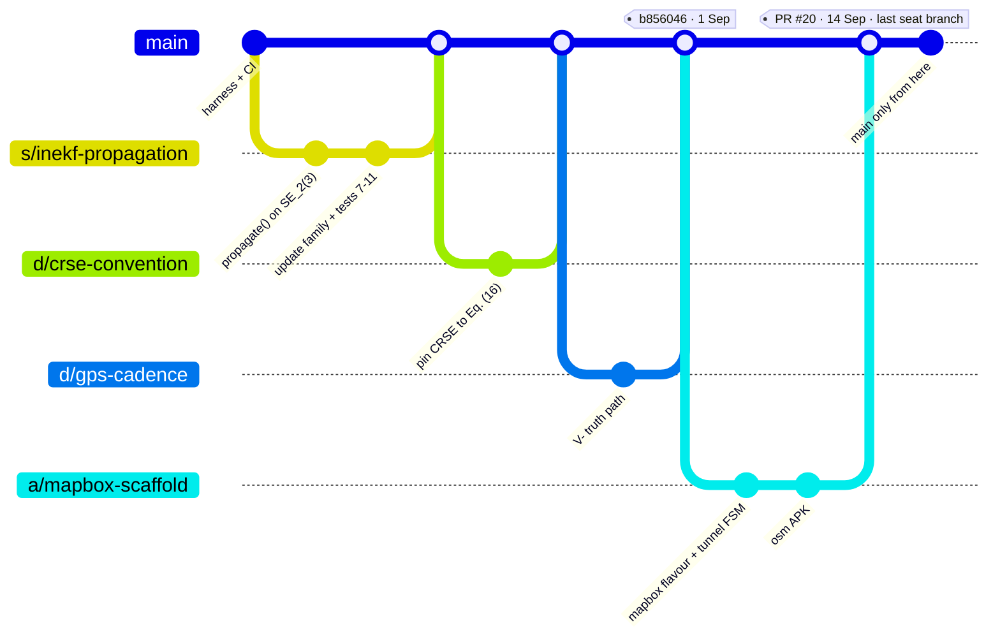

# Working Agreements

Six people, **thirteen days**, one number that decides everything. These are the rules that keep the
numbers defensible and the seats from colliding.

*(This file was written against a 25-day plan. The portal cut-off is **Tue 8 Sep 2026**, twelve days
earlier — D-021. The calendar lives in
[docs/IMPLEMENTATION_PLAN.md](docs/IMPLEMENTATION_PLAN.md) §5; nothing else here changed, because
none of it was ever slack.)*

---

## Seats and ownership

| Tag | Seat | Owns |
|---|---|---|
| **S** | Filter core & edge engine | `core/` |
| **M** | Learning | `models/` |
| **D** | Data & evaluation | `eval/`, `data/manifest/` |
| **P** | Maps & geodata | `maps/` |
| **A** | Android | `android/` |
| **C** | Field data & submission | `docs/METHOD.md`, deck, video |

**Cross-boundary changes need the owning seat's review.** The two interfaces most likely to cause a
collision are `core/ffi/` (S ↔ A) and the metrics signatures in `eval/metrics/` (D ↔ everyone).
Agree those contracts in writing **before** either side writes code against them.

---

## Branches and commits

- Default branch: `main`. It stays green.
- **Since 14 Sep 2026 all work lands on `main`.** The seat-branch rule below was the screening-era
  convention; the last seat branch, `a/mapbox-scaffold`, was merged in PR #20 and deleted. If you
  do open a branch for something you cannot land in one green push, name it `<seat>/<short-topic>`
  as before, keep it short, and delete it once merged — a branch that outlives its PR is a second
  copy of `main` that nobody is testing.
- Commit messages: imperative subject line, and **say why in the body when the why is not obvious**.
- Pull before you push, and run `pytest -q` first: CI runs on every push to `main`, so a red push
  is visible to everyone immediately, and the fix is a second commit, not a force-push.
- Never commit dataset bytes, model checkpoints, or OSM extracts. `.gitignore` blocks the common
  cases; it will not save you from `git add -f`. The one binary that *is* committed on purpose is
  `releases/app-osm-debug.apk` — when you replace it, update the **Built from** commit in
  [releases/README.md](releases/README.md) in the same commit.

---

## CI gates

These run on every push. They are not advisory. What
[`.github/workflows/ci.yml`](.github/workflows/ci.yml) actually runs:

```mermaid
flowchart LR
    PUSH(["push · PR · manual"]) --> J1
    PUSH --> J2

    subgraph J1["job: harness — py3.10 and py3.12"]
        direction TB
        L["<b>ruff check .</b>"] --> T["<b>pytest -q</b><br/><i>metrics, geodesy, splits, outages,<br/>SE_2(3) derivation, stamping</i>"] --> DR["<b>python -m eval.run --dry-run</b><br/><i>protocol validates with no data</i>"]
    end

    subgraph J2["job: leakage audit — its own visible gate"]
        direction TB
        LT["<b>pytest tests/test_leakage.py -v</b>"] --> LV["<b>feed the guard a V- column<br/>and require it to raise</b><br/><i>a guard never seen to fire<br/>is not known to work</i>"]
    end

    J1 --> OK{{"main stays green"}}
    J2 --> OK

    style J2 fill:#2d1a02,stroke:#9e6a03
    style LV fill:#da3633,color:#fff
```

The leakage audit is a **separate job** on purpose: it reads as a distinct line in the PR checks
rather than as one line inside a longer test log. PS 26168 disallows wheel odometry, so if that job
is ever green when it should be red, every number in the submission is invalid.

`torch` is deliberately **not** installed in CI — the harness is the critical path and must never be
blocked on a 2 GB download. `models/` therefore has no CI coverage; that is a known, accepted gap.

**Determinism** is covered at the unit level today (`test_same_seed_gives_identical_draws`,
`test_stamp_records_seed_and_commit`, `test_dirty_tree_is_flagged_as_unreproducible`). The
end-to-end two-machine reproduction is a **Gate 0 criterion, not a CI job**, and it is still open.

If a test is failing, fix the test or fix the code. Do not skip it, and do not merge around it.
**"Green on Ubuntu" is not "green" —** Gate 0 requires the suite passing on the primary dev machine
too, and it currently does not.

---

## Reproducibility

These exist because a number nobody can regenerate is a number nobody can defend, and the one
question a judge will certainly ask is "where did this come from?"

1. **Every figure and table carries the commit SHA and RNG seed that produced it.** Put it in the
   figure itself, not in a filename that gets renamed.
2. **One command regenerates every figure in the submission.** If regeneration needs manual steps,
   the figures will silently drift from the numbers in the text.
3. **Fixed seeds, reported.** Where run-to-run variance matters, report across ≥3 seeds.
4. **A result with unknown provenance is deleted, not debugged.**
5. Data lives outside git. `data/manifest/` carries source URL, download date and SHA-256 per file,
   and it is committed.

---

## Decision log discipline

Add a row to [docs/DECISION_LOG.md](docs/DECISION_LOG.md) whenever you make a choice that:

- a reviewer might reasonably have made differently, or
- was forced by something not visible in the code (a paper that omitted a hyperparameter, a device
  that would not sample above 100 Hz, a dataset folder that turned out to be unsynchronised), or
- changes anything in [docs/EVALUATION.md](docs/EVALUATION.md).

**Append only.** To reverse a decision, add a new row that supersedes the old one. Never edit
history — what we believed and when is exactly what the method document needs.

This is not bureaucracy. It is the method write-up, accumulated a line at a time instead of
reconstructed from memory in the final week.

---

## Documentation

- **[docs/EVALUATION.md](docs/EVALUATION.md) is frozen after Gate 0.** Changing it requires a
  decision-log row naming what changed, why, and which results it invalidated.
- **[docs/METHOD.md](docs/METHOD.md) is filled as work lands**, by the seat that did the work.
- **[docs/ERROR_BUDGET.md](docs/ERROR_BUDGET.md) is revised at each gate** with measured numbers
  replacing assumed ones.
- Update the relevant component README when you change an interface.

---

## Review

- Anything touching `eval/` needs seat D's review — it owns every number in the submission.
- Anything touching a public interface in `core/ffi/` needs both S and A.
- Small, frequent PRs. A 2,000-line PR on 7 September will not get a real review.
- Reviewing is not optional politeness. It is the second pair of eyes on numbers that will be
  defended in front of judges.

---

## Escalation

**If a gate is at risk, say so the day you know, not the day it is due.** ⚠️ **There is no longer a
buffer week** — the compression to 8 Sep (D-021) removed it, and the only buffer left is the morning
of submission day. The ordered cut list is now the whole margin, which is why it is ordered.

Cut list, in order: adaptive `R_NHC` → in-filter `R_sv` estimation (fall back to the PCA initialiser
with an inflated fixed covariance) → replay-renderer polish → the renderer entirely (static
matplotlib figures suffice). Already cut for screening: online HMM map matching, the Android app,
car-park mode, comma2k19 pretraining, the C++/Rust port.

Never cut: the evaluation harness, the leakage audit, the yaw instrument, the honest-limits section.
