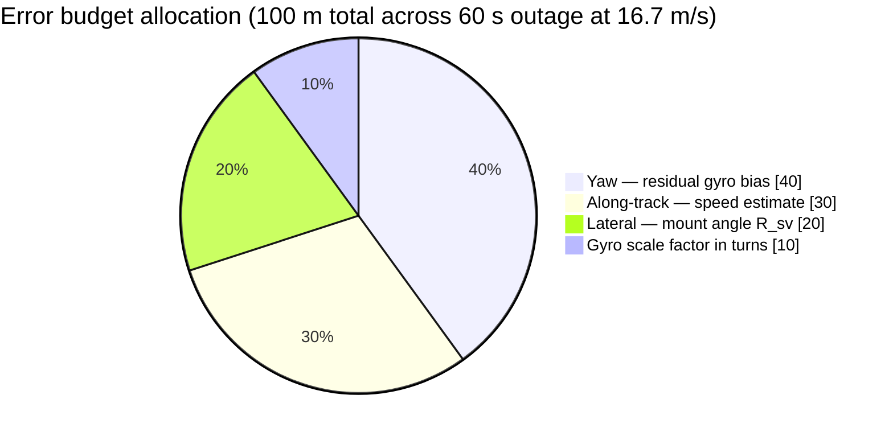

# idr-26168 — Intelligent Dead Reckoning for GNSS-Denied Ground Vehicles

Smart India Hackathon 2026 · Problem Statement **26168** · AI-based intelligent dead reckoning.

> **Grade Metric:** Position drift under **10% of distance travelled**  
> **Status:** Active development. CI green, 840+ automated Python tests plus JUnit test suites across both Android modules.  
> **Screening Submission:** Tue 8 Sep 2026 (for verification checklist and audit logs, see [docs/SUBMISSION_AUDIT.md](docs/SUBMISSION_AUDIT.md)).  
> **Plan of Record:** [docs/IMPLEMENTATION_PLAN.md](docs/IMPLEMENTATION_PLAN.md) (authoritative calendar and sprint plan, superseding prior sprint notes).

---

## Project Overview

Vehicle navigation in satellite-denied or degraded environments (such as urban canyons, underpasses, tunnels, and multi-level parking structures) presents severe challenges for consumer-grade sensors. Standard smartphone inertial sensors drift rapidly when integrated without external reference: an uncompensated 10 mg accelerometer bias compounds to roughly 176 meters of position error in just 60 seconds.

**idr-26168** provides a robust, physics-constrained, AI-enhanced dead reckoning engine designed to maintain accurate vehicle localization during prolonged GNSS outages, operating strictly within the regulatory constraints of Problem Statement 26168.

### Core Architectural Thesis

The navigation core is designed around a single, continuously-running error-state **Invariant Extended Kalman Filter (InEKF) formulated on the Lie group $\mathrm{SE}_2(3)$**. 

- **Seamless Transition by Construction:** The inertial measurement unit (IMU) continuously propagates state estimates. GNSS fixes serve strictly as an optional, $\chi^2$-gated innovation correction. When a vehicle enters a tunnel or loses satellite lock, incoming signals fail the innovation gate and are rejected. There is no secondary system, no handoff logic, and no mode switch, eliminating position jumps and transition latency.
- **Physics-Informed Constraints:** Three orthogonal constraints bound integration errors:
  1. **Learned Forward-Speed Head:** A causal Temporal Convolutional Network (TCN) regressing forward vehicle speed and predictive variance from body-frame IMU windows, avoiding double-integration of longitudinal acceleration.
  2. **Kinematic Constraints:** Non-Holonomic Constraints (NHC) enforcing zero lateral and vertical velocity in the vehicle frame, combined with Zero-Velocity Updates (ZUPT) and Zero Angular Rate Updates (ZARU) triggered during detected vehicle stops.
  3. **Map Matching:** Hidden Markov Model (HMM) map matching over an offline OpenStreetMap (OSM) Compressed Sparse Row (CSR) road graph, where emission variances are dynamically scaled by filter covariance.
- **Heading as the Dominant Error Term:** In ground vehicle dead reckoning, lateral error is dominated by heading uncertainty: $\text{Lateral Error} \approx \frac{1}{2} b_g v t^2$. Uncompensated gyroscope bias causes quadratic sideways drift and causes map matchers to snap onto parallel streets. Consequently, instrumenting and bounding yaw bias is the filter's primary focus.

---

## Architecture


When GNSS degradation occurs, observations fail the innovation test: no state update is applied, the filter continues smooth inertial propagation, and state covariance expands realistically.

---

## Error Budget Analysis

The error budget is dimensioned against a standard reference benchmark: a **60-second GNSS outage at 60 km/h (16.7 m/s)** spanning 1,000 meters of travel, corresponding to a maximum allowable drift budget of **100 meters (10%)**.



### Critical Tolerances

| Component | Error Contribution | Operating Constraint | Engineering Rationale |
|---|---|---|---|
| **Residual Gyro Bias** | 40 m | **0.005–0.01 °/s** post-ZARU | At 0.1 °/s, yaw drift alone consumes 52 m (>50% of the entire error budget). |
| **Speed Estimation** | 30 m | **< 0.5 m/s RMSE** | Prevents longitudinal stretch or compression during constant-speed cruising. |
| **Mount Misalignment ($R_{sv}$)** | 20 m | **$\approx 1^\circ$ alignment** | An uncorrected 5° mounting offset induces 87 m of lateral error over 60 s. |
| **Scale Factor Uncertainty** | 10 m | **Linearized in-turn** | Bounded during curve transitions. |

*Note: Map matching is deliberately excluded from the baseline budget allocation. Map matching provides safety margin on known road networks, but cannot be relied upon in unmapped environments such as parking structures. Full mathematical derivation: [docs/ERROR_BUDGET.md](docs/ERROR_BUDGET.md).*

---

## Tech Stack

- **Core Filtering:** Python reference InEKF on Lie group $\mathrm{SE}_2(3)$ (`core/reference/inekf.py`), with defined C/C++ FFI interface contracts (`core/ffi/idr_core.h`).
- **Deep Learning:** PyTorch causal TCN with heteroscedastic Gaussian negative log-likelihood (NLL) loss for uncertainty-aware forward speed regression (`models/speed_head.py`).
- **Evaluation & Geodesy:** High-precision Vincenty ellipsoidal distance and forward/inverse geodesy (`idr/geo.py`), IEEE-compliant Allan variance sensor profiling (`eval/allan.py`), deterministic outage injection, and cumulative trajectory metrics (CTE, CRSE, drift percentage, heading error).
- **Mobile Applications (Android):**
  - `android/`: Kotlin foreground sensor logger service capturing uncalibrated IMU streams at up to 125–200 Hz with microsecond timestamp synchronization.
  - `android-ui/`: Modern Jetpack Compose operator interface featuring OSMDroid offline map rendering, course-up navigation, live telemetry, tunnel detection state machine, and covariance ellipse visualization.
- **CI/CD & Automation:** GitHub Actions running multi-version Python matrix verification (3.10, 3.12), Ruff linting, leakage audits, and automated Android Gradle assemble/test suites.

---

## Project Structure

```
idr-26168/
├── core/
│   ├── reference/         # Invariant EKF reference implementation in Python
│   ├── ffi/               # C/C++ interface contract (idr_core.h) for edge deployment
│   ├── filter/            # Filter state, propagation, and measurement update models
│   └── constraints/       # Kinematic constraints (NHC, ZUPT, ZARU, mount angle)
├── models/
│   ├── speed_head.py      # TCN model predicting forward speed and log-variance
│   ├── baseline_rnn.py    # Reference Onyekpe INS RNN baseline model
│   ├── train_speed_head.py # Speed head training pipeline with heteroscedastic loss
│   └── export/            # Target deployment directory for exported network weights
├── eval/
│   ├── loaders/           # Dataset parsers (strict smartphone S- loader, truth loader)
│   ├── metrics/           # Evaluation metrics (CTE, CRSE, drift %, heading error)
│   ├── outages/           # Non-overlapping outage generator (10s, 30s, 60s, 120s, 180s)
│   ├── allan.py           # Allan deviation and bias instability parameter estimation
│   ├── cadence.py         # Empirical GNSS sampling rate and time-alignment analysis
│   ├── splits.py          # Deterministic train/validation/test dataset splits
│   ├── run.py             # Evaluation harness entry point (idr-eval)
│   └── replay/            # Standalone browser-based trajectory visualization tool
├── idr/
│   ├── geo.py             # Vincenty geodesy and local NED coordinate conversions
│   └── stamp.py           # Reproducibility stamp (git SHA, timestamp, dirty flag)
├── android/               # Foreground sensor logging service and session replay view
├── android-ui/            # Jetpack Compose navigation UI (OSM and Mapbox flavours)
├── releases/              # Pre-built installation APK (app-osm-debug.apk) and documentation
├── docs/                  # Architecture, mathematical derivations, protocols, decision log
├── tests/                 # Automated test suite (840+ unit and integration tests)
└── pyproject.toml         # Python project configuration, dependencies, and tool settings
```

---

## Installation & Setup

### Prerequisites

- Python `>= 3.10` (Python 3.10–3.12 supported)
- Git
- OpenJDK 17 (optional, required only for building Android applications)

### Setting Up the Python Environment

1. Clone the repository and navigate to the project root:
   ```bash
   git clone https://github.com/sushant-mishra-dtu/SIH-26168.git
   cd SIH-26168
   ```

2. Create and activate a virtual environment:
   - **macOS / Linux:**
     ```bash
     python3 -m venv .venv
     source .venv/bin/activate
     ```
   - **Windows (PowerShell):**
     ```powershell
     python -m venv .venv
     .\.venv\Scripts\Activate.ps1
     ```

3. Upgrade package installer and install the package in editable mode with development dependencies:
   ```bash
   pip install --upgrade pip
   pip install -e ".[dev]"
   ```

4. *(Optional)* Install machine learning dependencies if training neural network heads:
   ```bash
   pip install -e ".[ml]"
   ```

---

## Configuration & Environment Variables

The evaluation harness and core filtering engines operate deterministically without external API keys.

For the Android operator application (`android-ui/`):
- The default **`osm` flavour** uses OpenStreetMap tiles and requires zero API keys or external authentication.
- The optional **`mapbox` flavour** requires the following environment variables if building from source:
  - `MAPBOX_DOWNLOADS_TOKEN`: Secret token with `downloads:read` scope required to resolve the Mapbox Android SDK from the private Maven registry.

---

## Usage

### 1. Harness Protocol Dry Run

Verify that the evaluation harness, outage generator, and sequence partitioning function properly without requiring dataset downloads:

```bash
python -m eval.run --dry-run
```

### 2. Full Benchmark Evaluation

When the IO-VNBD dataset is downloaded to `data/IO-VNBD` (see [docs/DATASETS.md](docs/DATASETS.md)):

```bash
python -m eval.run --data data/IO-VNBD --seed 0
```

The harness injects non-overlapping outages across 10 s, 30 s, 60 s, 120 s, and 180 s durations, computes trajectory metrics, logs yaw error separately, and exports reproducible evaluation summaries.

### 3. Sensor Cadence and Truth Alignment

Measure empirical GNSS sampling rates and verify cross-sensor time synchronization:

```bash
python -m eval.cadence --data-root data
```

### 4. Running the Android Application

A pre-built APK for the `osm` flavour is available in the repository at [releases/app-osm-debug.apk](releases/app-osm-debug.apk). See [releases/README.md](releases/README.md) for direct installation instructions.

To compile and test the application directly:
```bash
# Build and test operator UI (OSM flavour)
cd android-ui && ./gradlew :app:assembleOsmDebug :app:testOsmDebugUnitTest

# Build and test background sensor logger
cd ../android && ./gradlew :app:assembleDebug :app:test
```

---

## Testing & Quality Gates

The test suite covers algorithmic derivations, invariance properties, numerical edge cases, schema validation, and regulatory compliance.

### Run Unit and Integration Tests

```bash
pytest -q
```

### Run Wheel-Speed Leakage Guard Audit

Problem Statement 26168 explicitly prohibits the use of vehicle CAN bus / wheel-speed odometry as input features. The repository enforces an automated leakage audit that fails CI if any vehicle stream column enters a feature tensor:

```bash
pytest tests/test_leakage.py -v
```

### Linting and Static Checks

```bash
ruff check .
```

---

## Current Implementation Status

| System Component | Implementation State | Verification Method | Lead |
|---|---|---|:---:|
| **Geodesy & Coordinates** | Fully implemented | Vincenty formulas verified against NGS benchmarks | S |
| **Evaluation Metrics** | Fully implemented | Hand-computed test fixtures; CRSE matches R-WhONet Eq. 16 | D |
| **Leakage Guard** | Fully implemented | Dedicated CI gate; verified to reject forbidden channels | D |
| **Outage Generator** | Fully implemented | Deterministic non-overlapping window partitioning verified | D |
| **Allan Profiler** | Fully implemented | IEEE-std bias instability and random walk extraction verified | D |
| **InEKF Propagation** | Fully implemented | $\mathrm{SE}_2(3)$ matrix exponential and Van Loan covariance verified | S |
| **Filter Updates** | Implemented | ZUPT, ZARU, NHC, and $\chi^2$-gated GNSS updates verified | S |
| **Mount Angle Estimation** | Implemented | PCA-based initialization and continuous in-filter tracking | S |
| **Speed Head Model** | Implemented | Causal TCN architecture with heteroscedastic loss | M |
| **Android Sensor Logger** | Fully implemented | Validated on Samsung Galaxy A55 5G at 125 Hz sustained | A |
| **Android Operator UI** | Fully implemented | APK published; OSM navigation and tunnel FSM integrated | A |
| **C/C++ Core FFI Contract** | Contract defined | `core/ffi/idr_core.h` JNI header specification | S |
| **Offline Map Matching** | Architecture specified | CSR topological representation detailed in `maps/README.md` | P |

---

## Limitations & Known Constraints

1. **Hardware-Constrained Inertial Noise:** Standard smartphone MEMS IMUs exhibit high bias instability and temperature drift. While zero-velocity updates (ZUPT) and zero-angular-rate updates (ZARU) suppress bias growth at stops, long outages (>120 s) at high sustained speeds will accumulate drift in the absence of road network constraints.
2. **GPS Update Cadence in Smartphone Datasets:** Real-world smartphone GPS streams in IO-VNBD update at approximately 9-second intervals rather than 1 Hz, requiring careful timestamp interpolation during ground-truth alignment.
3. **Map Matching Fallback:** Road-network map matching assumes standard street topologies and is ineffective inside unstructured multi-story garages or unmapped subterranean complexes. Under such conditions, the system relies strictly on kinematic constraints and barometric floor transitions.

---

## Documentation Index

| Resource | Scope and Intent |
|---|---|
| [docs/IMPLEMENTATION_PLAN.md](docs/IMPLEMENTATION_PLAN.md) | **Authoritative Plan of Record.** Milestones, deliverables, schedule, and technical risk register. |
| [docs/EVALUATION.md](docs/EVALUATION.md) | **Evaluation Protocol.** Metric definitions, outage specifications, and dataset handling. |
| [docs/ERROR_BUDGET.md](docs/ERROR_BUDGET.md) | **Error Budget Derivation.** Analytical derivation of heading, velocity, and mounting error terms. |
| [docs/SE23_PROPAGATION.md](docs/SE23_PROPAGATION.md) | **Lie Group Derivations.** Mathematical proof of state transitions on $\mathrm{SE}_2(3)$. |
| [docs/DATASETS.md](docs/DATASETS.md) | **Dataset Specifications.** IO-VNBD schema, coordinate frames, and synchronization details. |
| [docs/DECISION_LOG.md](docs/DECISION_LOG.md) | **Engineering Decision Log.** Chronological, immutable record of architectural decisions (D-001 through D-133). |
| [docs/METHOD.md](docs/METHOD.md) | **Technical Paper Draft.** Detailed methodology write-up with provenance stamps. |
| [docs/GLOSSARY.md](docs/GLOSSARY.md) | **Technical Glossary.** Mathematical definitions and domain terminology. |
| [android-ui/README.md](android-ui/README.md) | **Operator UI Guide.** Android app architecture, Compose UI, and testing instructions. |
| [releases/README.md](releases/README.md) | **Release Notes.** APK installation instructions and release artifacts. |

---

## Engineering Non-Negotiables

To maintain research integrity and ensure reproducibility:

1. **Only Smartphone Channels as Inputs:** Wheel speed data (`V-` channels) must never enter feature tensors. Compliance is enforced via automated CI leakage tests.
2. **Never Double-Integrate Acceleration for Speed:** Accelerometer bias compounds quadratically; velocity must be obtained via kinematic constraints or learned estimators.
3. **Rigorous Test Reproducibility:** Every generated plot, table, and benchmark artifact must be stamped with its originating git commit hash and random seed.
4. **Independent Yaw Error Instrumentation:** Heading error must always be monitored and reported as an independent metric.
5. **Honest Baseline Comparisons:** Automotive-grade IMU results (e.g. AI-IMU on KITTI) and wheel-odometry baselines (e.g. WhONet) must be explicitly distinguished from smartphone-only dead reckoning benchmarks.

---

## Contributing

Please review [CONTRIBUTING.md](CONTRIBUTING.md) for guidelines on code formatting, branch conventions, and testing requirements before submitting pull requests. All changes must pass CI validation and maintain clean leakage audit tests.
