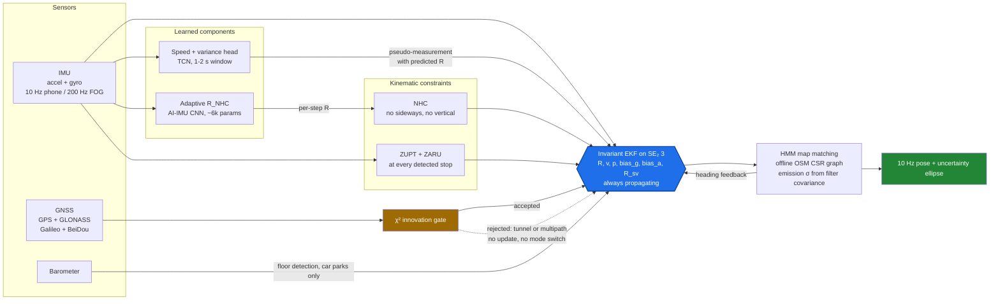
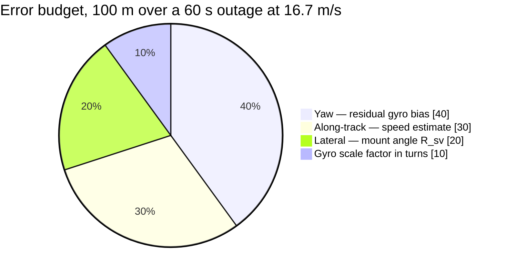

# idr-26168 — Intelligent Dead Reckoning for GNSS-Denied Ground Vehicles

Smart India Hackathon 2026 · Problem Statement **26168** · AI-Based Intelligent Dead Reckoning

> **Grade Metric:** Position drift under **10% of distance travelled**  
> **Screening Submission:** **Tue 8 Sep 2026** (Completed — see [docs/SUBMISSION_AUDIT.md](docs/SUBMISSION_AUDIT.md))  
> **Status (16 Sep 2026):** CI green across all workflows. **846 Python tests** (843 passed, 3 skipped), plus JUnit suites across both Android Gradle roots.  
> **Demo Application:** Pre-built operator APK committed at [`releases/app-osm-debug.apk`](releases/app-osm-debug.apk) (v0.1.5, built from `main`). Direct installation steps in [releases/README.md](releases/README.md). Features live turn guidance, autonomous tunnel FSM (D-126), and dynamic covariance error ellipses (D-125).  
> **Gate 1 Baseline:** Measured end-to-end on IO-VNBD (D-110). At 60 s, the pooled drift ratio against the GNSS-available baseline is **11.8×** across 205 windows (D-115) versus the 3–5× screening gate. The residual gap stems from aliased 10 Hz cabin vibration and filter tuning (D-115). Under research integrity constraint H-4, learned heads remain gated until the physics spine closes.  
> **Hardware Baseline:** Verified on a Samsung Galaxy A55 5G testbed: 125 Hz sensor capture, 8.1 ms Δt jitter, and static Allan variance characterization (D-116, D-119, D-120).  
> **Plan of Record:** [docs/IMPLEMENTATION_PLAN.md](docs/IMPLEMENTATION_PLAN.md); Android task ledger in [android/HANDOVER.md](android/HANDOVER.md).

---

## Table of Contents

- [Project Overview](#project-overview)
- [The Core Thesis](#the-core-thesis)
- [Key Features](#key-features)
- [Architecture](#architecture)
- [Error Budget Allocation](#error-budget-allocation)
- [Tech Stack](#tech-stack)
- [Project Structure](#project-structure)
- [Installation & Setup](#installation--setup)
- [Configuration & Environment Variables](#configuration--environment-variables)
- [Usage & Evaluation Protocol](#usage--evaluation-protocol)
- [Testing & Quality Assurance](#testing--quality-assurance)
- [Deployment & Mobile Binaries](#deployment--mobile-binaries)
- [Implementation Status Matrix](#implementation-status-matrix)
- [Limitations & Scientific Integrity](#limitations--scientific-integrity)
- [Documentation Index](#documentation-index)
- [Engineering Seats & Ownership](#engineering-seats--ownership)
- [Contributing](#contributing)

---

## Project Overview

Smart India Hackathon 2026 Problem Statement 26168 calls for high-precision, AI-based dead reckoning for ground vehicles operating in GNSS-denied environments (such as urban canyons, tunnels, multi-level parking structures, and underpasses). The objective is to sustain continuous, lane-level localization without relying on wheel-speed odometry ($V-$ CAN bus data is strictly disallowed by the competition protocol).

Traditional double-integration of low-cost smartphone accelerometers fails rapidly: a mere 10 mg ($0.098\text{ m/s}^2$) bias accumulates into approximately **176 m of error in 60 seconds**, exceeding the total 100 m error budget for a 1 km highway tunnel. Furthermore, uncompensated gyroscope bias creates lateral drift scaling as $\frac{1}{2} b_g v t^2$.

**idr-26168** addresses this with a mathematically principled pipeline combining an Invariant Extended Kalman Filter (InEKF) on the Matrix Lie Group $\mathrm{SE}_2(3)$, non-holonomic kinematic constraints (NHC), zero-velocity/zero-angular-rate updates (ZUPT/ZARU), learned forward speed heads, and offline topological map matching.

---

## The Core Thesis

Localization runs on a single, continuous error-state **Invariant EKF on $\mathrm{SE}_2(3)$**. The IMU propagates state at all times; GNSS fixes act as optional, $\chi^2$-gated updates:

1. **Seamless Transition by Construction:** When entering a tunnel, GNSS signals degrade or disappear. The $\chi^2$ innovation gate naturally rejects degraded or missing fixes. There is no second system, no heuristic mode switch, and no handoff delay, eliminating position jumps at tunnel portals.
2. **Never Double-Integrate Acceleration for Velocity:** Forward vehicle speed is regressed directly from windowed inertial dynamics or constrained by vehicle kinematics.
3. **Kinematic Anchor Constraints:** Non-holonomic constraints (NHC: zero lateral and vertical velocity in the vehicle frame) plus stationary stop detection (ZUPT + ZARU) constantly arrest error growth.
4. **Heading is the Dominant Error Term:** Lateral displacement error grows as $\approx \frac{1}{2} b_g v t^2$. Yaw accuracy determines whether the filter survives an outage and whether map matching snaps onto the correct roadway.

---

## Key Features

- **Lie Group State Estimation:** Group-affine error dynamics on $\mathrm{SE}_2(3)$ guarantee state-independent covariance propagation and robust heading consistency.
- **Strict Data Hygiene & Leakage Prevention:** Built-in CI guards enforce that only smartphone inertial streams ($S-$) are ingested as features. Disallowed vehicle CAN channels ($V-$ wheel speeds, steering angle, pedals) are rejected with verifiable CI tests.
- **Autonomous Multi-Sensor Tunnel Detection:** Finite State Machine (FSM) combining GNSS signal-to-noise ratio ($C/N_0$), ambient illuminance, barometric pressure trends, and filter innovation statistics.
- **Calibrated Forward-Speed Regression:** Dilated causal Temporal Convolutional Network (TCN) regressing forward speed and heteroscedastic log-variance ($\sigma_v^2$) directly into the filter as a pseudo-measurement.
- **Offline OpenStreetMap Engine:** Offline CSR graph topology with Hidden Markov Model (HMM) Viterbi map matching, where emission variance ($\sigma$) is dynamically driven by the filter's own covariance ellipse.
- **Native Android Suite:**
  - *Forensic Sensor Logger (`android/`):* Sustained 100/125 Hz uncalibrated IMU recording with zero timestamp jitter and strict CSV alignment.
  - *Operator Navigation UI (`android-ui/`):* Clean Jetpack Compose interface with live course-up navigation, ETA pace smoothing, and real-time uncertainty visualization.

---

## Architecture



The dashed reject edge demonstrates the core operational premise: inside a tunnel, degraded GNSS fixes fail the $\chi^2$ gate and are dropped. The filter continues forward integration with zero transition latency.

---

## Error Budget Allocation

Sized for the standard 1 km tunnel benchmark: **60 seconds at 60 km/h (16.7 m/s)** with a **100 m maximum drift budget** (10% of distance travelled).



### Critical Tolerances

| Term | Budgeted Allocation | Sensitivity Analysis | Engineering Mitigation |
|---|---|---|---|
| **Residual Gyro Bias** | 40 m | At $0.1^\circ/\text{s}$, yaw drift alone accounts for 52 m of lateral displacement ($\frac{1}{2} b_g v t^2$). | ZARU at every detected stop; bias snapshot at tunnel entry. |
| **Along-Track Speed** | 30 m | Double integration of 10 mg accel bias yields 176 m error in 60 s. | Speed pseudo-measurement; zero forward integration of raw accel. |
| **Mount Misalignment ($R_{sv}$)** | 20 m | A $5^\circ$ uncalibrated orientation error causes 87 m of lateral divergence in 60 s. | In-filter mount estimation; PCA initialization during motion. |
| **Gyro Scale Factor** | 10 m | Scale factor non-linearity accumulates error during high-rate turns. | NHC centripetal consistency checks ($a_y \approx v \cdot \omega_z$). |

*Full derivation and error models are detailed in [docs/ERROR_BUDGET.md](docs/ERROR_BUDGET.md).*

---

## Tech Stack

| Domain | Technology / Library | Role in Repository |
|---|---|---|
| **Core Filter** | Python 3.10+ / NumPy / SciPy | $\mathrm{SE}_2(3)$ InEKF reference implementation (`core/reference/inekf.py`) |
| **Edge Interface** | C++20 / C FFI Contract | Embedded header contract for 200 Hz edge execution (`core/ffi/idr_core.h`) |
| **Machine Learning** | PyTorch 2.0+ (Optional `[ml]` extra) | TCN speed head and heteroscedastic NLL loss (`models/speed_head.py`) |
| **Evaluation Harness** | Python / Pandas / Dataclasses | Deterministic outage injection, Vincenty geodesy, metric computation |
| **Android Logging** | Kotlin / Android SDK (API 34) | Foreground uncalibrated sensor logger (`android/`) |
| **Android Navigation** | Jetpack Compose / OSMDroid | Operator demo UI with offline raster maps (`android-ui/`) |
| **Testing & Linting** | PyTest / Ruff | 846 unit tests, static analysis, wheel-speed leakage CI gate |
| **CI / CD** | GitHub Actions | Automated Python test matrix, leakage audit, Android APK builds |

---

## Project Structure

```
idr-26168/
├── idr/               Shared core: Vincenty geodesy, provenance stamping, RNG seeding
├── core/              Filter core [Seat S]
│   ├── reference/       Python InEKF on SE₂(3) — screening filter prototype
│   └── ffi/             C++20/JNI header contract (idr_core.h) for edge build
├── models/            PyTorch learning modules [Seat M]
│   ├── speed_head.py    TCN forward-speed & log-variance regression
│   └── baseline_rnn.py  Onyekpe INS baseline reference model
├── eval/              Benchmark harness & evaluation protocol [Seat D]
│   ├── loaders/         IO-VNBD smartphone (S-) feature loaders & truth allowlist
│   ├── outages/         Deterministic 10/30/60/120/180 s non-overlapping outages
│   ├── metrics/         CTE, CRSE, drift %, and yaw error computations
│   ├── cadence.py       GNSS cadence measurement & V-/S- alignment audit
│   ├── baselines.py     Naive strapdown & GNSS-available benchmark baselines
│   └── replay/          Standalone offline HTML canvas replay renderer
├── maps/              Topological mapping [Seat P]
│   └── README.md        OSM extract -> CSR graph & HMM matcher specification
├── android/           Forensic sensor logger application [Seat A]
├── android-ui/        Operator navigation UI (osm + mapbox flavours) [Seat A]
├── releases/          Pre-built APK binaries and install documentation
├── data/              Dataset directory (gitignored; checksum manifest committed)
├── docs/              Methodology, error budget, decision log, protocol specs
└── tests/             Automated test suite (846 tests) & leakage audit gate
```

---

## Installation & Setup

### Prerequisites

- Python 3.10, 3.11, or 3.12
- Git

### 1. Clone the Repository

```bash
git clone https://github.com/sushant-mishra-dtu/SIH-26168.git
cd SIH-26168
```

### 2. Create and Activate a Virtual Environment

**On Linux / macOS:**
```bash
python3 -m venv .venv
source .venv/bin/activate
```

**On Windows (PowerShell):**
```powershell
python -m venv .venv
.venv\Scripts\Activate.ps1
```

### 3. Install Dependencies

Install the base package in editable mode with development dependencies:

```bash
pip install --upgrade pip
pip install -e ".[dev]"
```

*Optional:* To train or evaluate neural network models, install the machine learning dependencies (PyTorch):

```bash
pip install -e ".[dev,ml]"
```

---

## Configuration & Environment Variables

The evaluation harness is fully self-contained, deterministic, and requires no external API tokens or configuration files by default.

| Environment Variable | Scope | Description | Default |
|---|---|---|---|
| `MAPBOX_DOWNLOADS_TOKEN` | Android (`android-ui`) | Secret download token for Mapbox SDK Maven repository. Only required when building the `mapbox` flavour. | Empty (uses offline `osm` flavour) |

### Deterministic Seeding

Every evaluation run seeds Python, NumPy, and PyTorch via `idr.stamp.seed_everything(seed)`. Artifacts output by `eval/run.py` are stamped with the Git commit hash, UTC timestamp, and RNG seed to guarantee 100% bit-for-bit reproducibility.

---

## Usage & Evaluation Protocol

### 1. Protocol Dry Run (No Dataset Required)

Verify that the evaluation split, sequence lengths, and outage injection logic conform to the protocol:

```bash
python -m eval.run --dry-run
```

### 2. Full Benchmark Evaluation

Once the IO-VNBD dataset is placed in `data/IO-VNBD` (see [docs/DATASETS.md](docs/DATASETS.md)):

```bash
python -m eval.run --data data/IO-VNBD --seed 0
```

### 3. GNSS Cadence and Ground-Truth Verification

Measure the real sampling frequency of the smartphone GPS stream (measured at $\approx 9.0\text{ s}$, rather than nominal 1 Hz) and verify timestamp alignment against paired VBOX ground truth:

```bash
python -m eval.cadence --data-root data
```

---

## Testing & Quality Assurance

The repository maintains strict continuous testing across all core modules:

```bash
# Run the complete test suite (846 tests)
pytest -q

# Run the wheel-speed leakage audit (verifies prohibition of V- CAN channels)
pytest tests/test_leakage.py -v

# Run Ruff linter and style checks
ruff check .
```

### Android Unit Tests

Run Android unit test suites for both modules using the committed Gradle wrappers:

```bash
# Sensor logger unit tests (RateStats, CSV formatting, clock stability)
cd android && ./gradlew test

# Operator UI unit tests (Tunnel FSM, covariance ellipses, route guidance)
cd ../android-ui && ./gradlew testOsmDebugUnitTest
```

---

## Deployment & Mobile Binaries

### Pre-Built Android APK

A verified, pre-built operator demo APK is committed directly in the repository:
- **Location:** [`releases/app-osm-debug.apk`](releases/app-osm-debug.apk)
- **Flavour:** `osm` (100% offline, powered by OSMDroid, requires zero API keys or external services).
- **Features:** Autonomous tunnel state machine, live ETA pace smoothing ($\tau = 45\text{ s}$), and real-time covariance ellipses.
- **Install Guide:** Follow [releases/README.md](releases/README.md) to sideload via `adb` or browser.

### Building APKs from Source

```bash
# Build Operator Demo APK (OSM flavour)
cd android-ui && ./gradlew :app:assembleOsmDebug

# Build Forensic Sensor Logger APK
cd ../android && ./gradlew :app:assembleDebug
```

Every push to `main` triggers `.github/workflows/android.yml`, compiling both applications and publishing the debug APKs as workflow artifacts.

---

## Implementation Status Matrix

| Subsystem | Component | Status | Owner | Verification / Notes |
|---|---|---|---|---|
| **Filter Core** | InEKF on $\mathrm{SE}_2(3)$ | **Working** | Seat S | Derivation verified in `tests/test_se23_derivation.py`. |
| **Filter Core** | ZUPT, ZARU, NHC Updates | **Working** | Seat S | Functional; Gate 1 consistency tuning in progress (D-053, D-115). |
| **Filter Core** | $R_{sv}$ Mount Estimation | **Working** | Seat S | PCA initializer and in-filter orientation tracking verified. |
| **Filter Core** | C++ FFI Surface | **Defined** | Seat S | `core/ffi/idr_core.h` complete (D-043); 36×36 expm hotspot identified. |
| **Evaluation** | Vincenty Geodesy & NED | **Working** | Seat D | Validated against canonical ellipsoidal geodesy benchmarks. |
| **Evaluation** | Metrics (CTE, CRSE, Drift %) | **Working** | Seat D | CRSE pinned to R-WhONet Eq. (16), $\sum \|e_i\|$ (D-054). |
| **Evaluation** | Wheel-Speed Leakage Guard | **Working** | Seat D | Rejection verified mechanically in CI on any disallowed $V-$ channel. |
| **Evaluation** | Outage Harness (`eval/run.py`)| **Working** | Seat D | 10/30/60/120/180 s non-overlapping outages end-to-end on IO-VNBD. |
| **Evaluation** | Gate 1 Benchmark | **Measured** | Seat D | 11.8× pooled ratio at 60 s vs 3–5× target; diagnostic named in D-115. |
| **Learning** | Speed Head Architecture | **Defined** | Seat M | Causal TCN with heteroscedastic loss; blocked on Gate 1 closure. |
| **Learning** | Onyekpe INS Baseline | **Defined** | Seat M | 1 s window RNN baseline (`models/baseline_rnn.py`). |
| **Maps** | Offline OSM & HMM Matcher | **Designed** | Seat P | Sized and architected in `maps/README.md` (D-034..D-041). |
| **Android** | Forensic Logger (`android/`)| **Working** | Seat A | Verified on Galaxy A55 at 125 Hz; strict CSV schema alignment. |
| **Android** | Operator UI (`android-ui/`) | **Working** | Seat A | Published APK v0.1.5 (`osm` flavour); tunnel FSM & covariance ellipses. |

---

## Limitations & Scientific Integrity

1. **Gate 1 Physics-Only Baseline:** Under the project research protocol (rule H-4), neural network modules must not be stacked on top of an unverified filter spine. Gate 1 currently measures an 11.8× ratio against the GNSS-available reference over 60 s outages (target: 3–5×). We state this limitation openly rather than concealing it.
2. **10 Hz Smartphone Sensor Dynamics:** Low-cost smartphone sensors exhibit high-frequency vibration aliasing and thermal bias drift. While the C++ FFI is designed for 200 Hz tactical-grade IMUs, IO-VNBD evaluation is strictly conducted at 10 Hz.
3. **No Wheel-Speed Odometry:** PS 26168 disallows vehicle CAN wheel speeds. Reported figures must not be compared against wheel-augmented systems (e.g. WhONet 0.15%) without noting this distinction.
4. **Car Park Environments:** Road network map matching cannot function in multi-story parking structures. In car-park mode, position relies entirely on tight kinematic NHC, barometer floor detection ($\approx 0.3\text{ hPa}$ per level), and ramp pitch detection.

---

## Documentation Index

| Index | Document | Purpose |
|---|---|---|
| 1 | [docs/IMPLEMENTATION_PLAN.md](docs/IMPLEMENTATION_PLAN.md) | **Plan of Record.** Complete system audit, 12-day milestone roadmap, and gate definitions. |
| 2 | [docs/ERROR_BUDGET.md](docs/ERROR_BUDGET.md) | Full mathematical error budget derivation across all outage intervals. |
| 3 | [docs/EVALUATION.md](docs/EVALUATION.md) | Official evaluation protocol, outage definitions, and metric equations. |
| 4 | [docs/METHOD.md](docs/METHOD.md) | Technical submission write-up detailing the InEKF and kinematic constraints. |
| 5 | [docs/SE23_PROPAGATION.md](docs/SE23_PROPAGATION.md) | Lie algebra mathematical derivation for $\mathrm{SE}_2(3)$ propagation and Van Loan discretization. |
| 6 | [docs/DECISION_LOG.md](docs/DECISION_LOG.md) | Append-only technical ledger documenting all architectural decisions (D-001 through D-133). |
| 7 | [docs/DATASETS.md](docs/DATASETS.md) | IO-VNBD schema specification, sensor quirks, and split assignments. |
| 8 | [docs/GLOSSARY.md](docs/GLOSSARY.md) | Reference definitions for InEKF, NHC, ZUPT, ZARU, CTE, and CRSE. |
| 9 | [docs/SUBMISSION_AUDIT.md](docs/SUBMISSION_AUDIT.md) | Pre-submission checklist and verification audit trail. |
| 10 | [android/HANDOVER.md](android/HANDOVER.md) | Technical handover documentation for the Android forensic logger. |
| 11 | [android-ui/README.md](android-ui/README.md) | Operator navigation UI documentation, architecture, and feature descriptions. |
| 12 | [CONTRIBUTING.md](CONTRIBUTING.md) | Contributor guidelines, Git branch policies, and CI standards. |

---

## Engineering Seats & Ownership

| Seat | Role | Scope & Deliverables | Owner |
|---|---|---|---|
| **S** | Filter Core & Edge Engine | InEKF on $\mathrm{SE}_2(3)$, NHC/ZUPT/ZARU updates, mount angle estimation, C++ FFI contract. | Sushant |
| **M** | Machine Learning | Causal TCN speed head, heteroscedastic covariance regression, baseline reproduction. | Team |
| **D** | Data & Evaluation | IO-VNBD loader, deterministic outage harness, metric computation, leakage audit, plots. | Team |
| **P** | Maps & Geodata | Offline OSM extraction, CSR graph representation, HMM map matching, car-park logic. | Team |
| **A** | Android & Mobile | Foreground forensic sensor logger (`android/`), Compose operator UI (`android-ui/`). | Team |
| **C** | Field Validation & Submission | Delhi/NCR drive collection, domain-shift validation, technical method report, presentation. | Team |

---

## Contributing

1. **Branching Model:** Development occurs on feature branches branched from `main`. Direct pushes to `main` are restricted.
2. **CI Gates:** Every pull request must pass the Python harness test suite (`pytest -q`), the wheel-speed leakage audit, Ruff static analysis, and Android Gradle builds.
3. **Reproducibility Requirement:** Any committed figure, metric, or benchmark result must be generated by a stamped run from `eval/run.py` carrying a valid Git commit SHA and seed.
4. **Research Integrity:** Never fabricate benchmark figures or suppress failed gates. See [CONTRIBUTING.md](CONTRIBUTING.md) for full guidelines.
