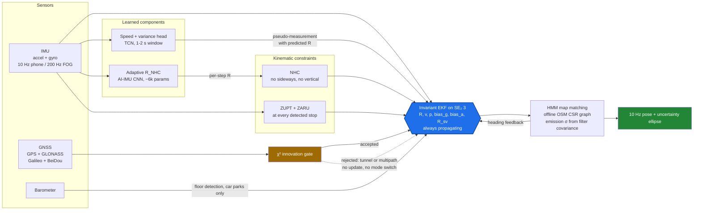
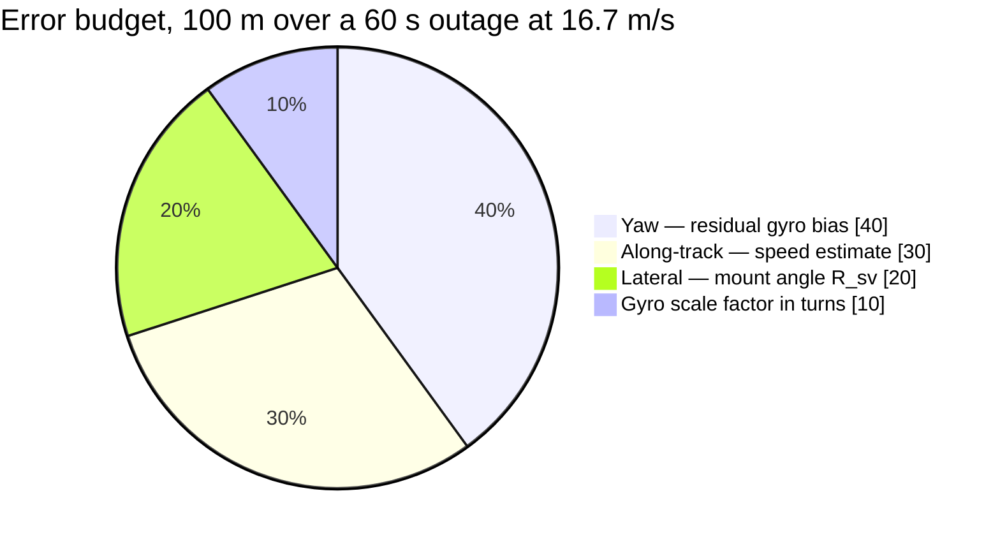
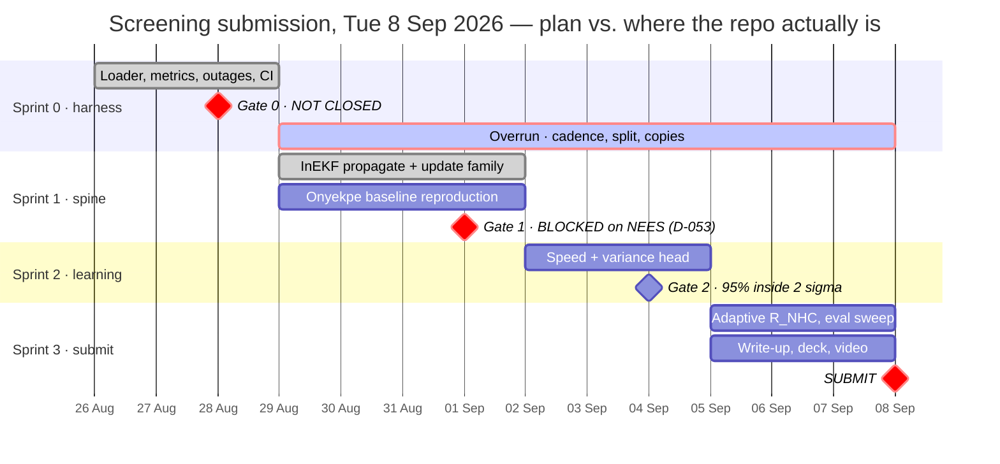
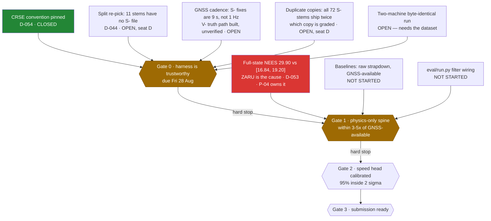
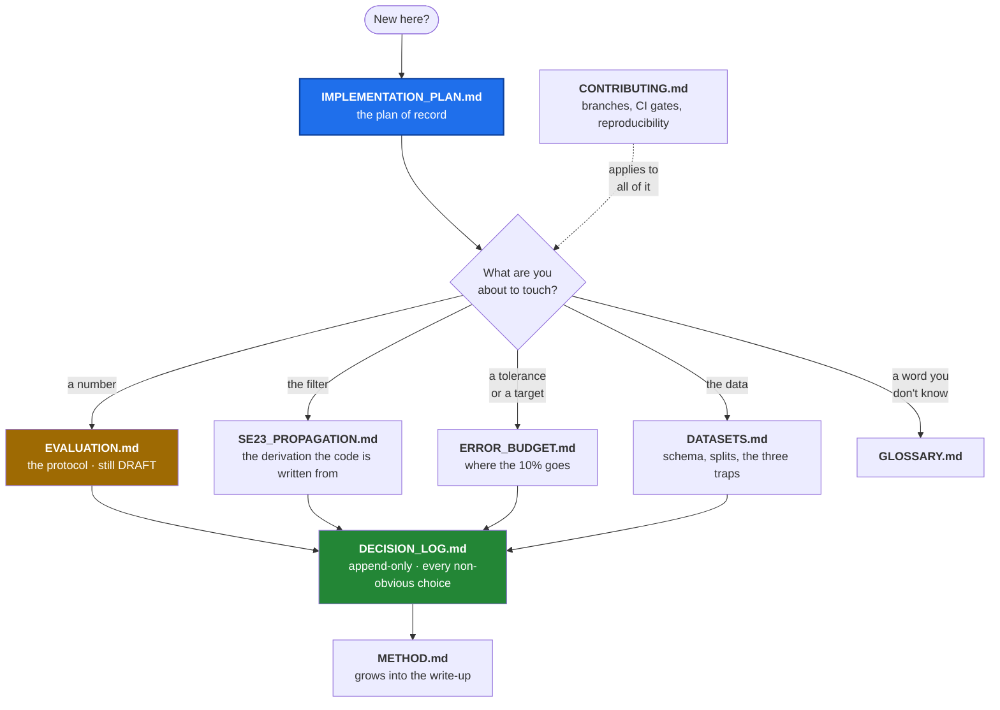

# idr-26168 — Intelligent Dead Reckoning for GNSS-Denied Ground Vehicles

Smart India Hackathon 2026 · Problem Statement **26168** · AI-based intelligent dead reckoning.

> **Grade metric:** position drift under **10% of distance travelled**
> **Screening submission:** **Tue 8 Sep 2026** — **3 days out**
> **Status, Fri 5 Sep:** the last change landed **1 Sep** (`b856046`). The plan of record puts
> today in Sprint 3; the repo is still at the end of Sprint 1. InEKF `propagate()` and the full
> update family are wired and tested; nothing downstream of the filter has run on real data,
> because IO-VNBD is not on this machine.
> **Gate 0 is not closed** and the protocol is still DRAFT: CRSE is pinned (D-054), but the split
> re-pick, the GNSS cadence and the duplicate-copy choice are all open.
> **Gate 1 is blocked** on filter consistency — full-state NEES is 29.90 against a
> [16.84, 19.20] band, and ZARU is the cause (D-053).
> **Plan of record:** [docs/IMPLEMENTATION_PLAN.md](docs/IMPLEMENTATION_PLAN.md) *(27 Aug — supersedes
> the sprint calendars in AGENTS.md and SPRINT_BOARD.md)*

---

## The thesis in one paragraph

One continuously-running error-state **Invariant EKF on SE₂(3)**. The IMU always propagates; GNSS is
an *optional* χ²-gated correction. There is no second system and no handoff, so the problem
statement's "seamless transition within milliseconds" is satisfied **by construction** rather than
by clever code. Three inputs keep the filter honest: a **learned forward-speed head** (never
double-integrated accel), **kinematic constraints** (NHC + ZUPT + ZARU), and **HMM map matching**
over an offline OSM graph whose emission σ is driven by the filter's own covariance.

**The dominant error term is yaw, not speed.** Lateral error grows as ≈ ½·b_g·v·t² — unbounded,
sideways, and it makes map matching snap confidently onto the wrong road.

---

## Architecture



The dashed edge is the whole argument: in a tunnel nothing passes the gate, so nothing is applied.
There is no code path to switch, therefore no transition latency and no position jump.

---

## Where the 10% goes

Sized against the reference case — 1 km tunnel, 60 s at 60 km/h, so a **100 m** total budget.



Two requirements fall out of that arithmetic, and both are tighter than they look:

| Term | Requirement | Why it bites |
|---|---|---|
| Residual gyro bias | **0.005–0.01 °/s** after ZARU | At 0.1 °/s the yaw term alone eats 52 m — half the budget |
| Phone→vehicle yaw (R_sv) | **≈ 1°** | A 5° knock costs 87 m over the same outage, silently |

Map matching is deliberately **not** in the allocation. It buys margin back; it is not a term we
plan to spend — because it does not exist in a car park. Full derivation:
[docs/ERROR_BUDGET.md](docs/ERROR_BUDGET.md).

---

## Schedule — 3 days left, and two gates still open



The plan of record's calendar is unchanged; what moved is the repo against it. Sprint 0 never
closed, so its overrun bar runs underneath everything after it.



**Gate 1 is a hard stop.** No network goes on top of a filter that has not cleared physics-only.
If it fails, diagnose in order: timestamps → NHC gating → process noise → ZUPT thresholds.

With three days left the cut list bites hard. Realistically **in scope**: harness, leakage audit,
physics-only InEKF, eval sweep, write-up. **At risk**: the speed+variance head, which cannot start
until Gate 1 clears. Already **deferred to post-screening**: online HMM map matching, the Android
app, car-park mode, comma2k19 pretraining, and the C++/Rust port.
See [docs/IMPLEMENTATION_PLAN.md](docs/IMPLEMENTATION_PLAN.md) §5.

---

## Quick start

```bash
python -m venv .venv && ./.venv/Scripts/pip install -e ".[dev]"
```

Run the tests — none of them need the dataset:

```bash
pytest -q
```

> ⚠️ **One test is red on the Windows dev box.**
> `test_reorthonormalisation_keeps_r_on_so3` asserts `max|RᵀR − I| < 1e-15` and measures
> `1.22e-15` here — a tolerance set one ULP too tight, not a filter defect. It is exactly the
> failure R-7 predicted: *CI green on Ubuntu is not evidence the Windows dev box works.*
> **Gate 0 requires `pytest` green on the primary machine**, so this is a Gate 0 item, not a nit.

Validate the evaluation protocol without any data:

```bash
python -m eval.run --dry-run
```

Everything below needs IO-VNBD in `data/` (see [docs/DATASETS.md](docs/DATASETS.md)).
The full sweep — note that `run.py`'s filter wiring is still a TODO, so today it exits 3:

```bash
python -m eval.run --data data/IO-VNBD --seed 0
```

Re-derive the process noise `Q` from the dataset's own stationary segments (D-045):

```bash
python -m eval.allan --paths-from data/manifest/allan_segments_input.txt --out-dir eval/figures
```

Measure what the GNSS actually does, and whether the paired `V-` track can serve as ground truth.
The `S-` smartphone GPS updates roughly every **9 s**, not the 1 Hz the protocol was drafted
against, so this is a Gate 0 blocker rather than a diagnostic:

```bash
python -m eval.cadence --data-root data
```

Its `truth_alignment.csv` is the **abort gate** for the whole cadence fix: if the paired `V-` track
does not pass within ~3–10 m of the `S-` stream's own fixes at zero lag, sourcing truth there is
not sound and the protocol falls back to drift-%-only reporting.

---

## What is built and what is not

| Layer | State | Owner |
|---|---|---|
| Vincenty geodesy, NED, angle wrapping | **working**, tested against the canonical reference | S |
| CTE, CRSE, drift %, yaw error | **working**, each against a hand-computed case. CRSE pinned to R-WhONet Eq. (16), `Σ\|eᵢ\|` (D-054) | D |
| Wheel-speed leakage guard | **working**, and verified to reject | D |
| Outage injection + non-overlap proof | **working** | D |
| Frozen train/test split | **working**, but it names **3 long-outage sequences, not 9** — 11 stems have no `S-` file (D-044). Re-pick is open | D |
| Provenance stamping, seeding | **working** | D |
| Allan variance → `Q_c` from IO-VNBD's own stationary segments | **working**, artefacts committed and stamped (D-045). Bias instability is an upper bound; the two bias driving noises are *derived*, not measured | S |
| Constraint gating, χ² gate, stop detection | **working**. Caveat: `is_stationary` reads a perfectly straight constant-speed cruise as stationary — real cabin vibration is what saves it | S |
| InEKF `propagate()` on SE₂(3) | **working**, against the derivation | S |
| InEKF update family — ZUPT, ZARU, NHC, GNSS | **working but not yet consistent** — over-confident, ZARU is the cause (D-053). P-04 owns it | S |
| Ground truth from the paired `V-` VBOX GPS | **built, not yet verified against real bytes** — run `python -m eval.cadence` | D |
| `eval/run.py` filter wiring | **not started** — the TODO at its centre is the last piece of harness, and Gate 1's numbers come out of it | D |
| Raw-strapdown and GNSS-available baselines | **not started**. Gate 1 is a *ratio* between them, so both must exist before Gate 1, not alongside it | P |
| Speed pseudo-measurement | `NotImplementedError` — Sprint 2 | S+M |
| Speed head, Onyekpe baseline | architecture defined, untrained | M |
| OSM graph, HMM matcher | designed and sized (D-034–D-037, D-041); no code | P |
| Android logger, demo UI | not started | A |
| Replay renderer (D-039), `core/ffi/` contract (D-043) | not started | A, S |

The `NotImplementedError` placeholders are deliberate: a stub returning `None` would let the
harness produce plausible all-zero trajectories and report them as results.

---

## Repo map

```
idr-26168/
├── idr/               shared: geodesy, provenance stamping, seeding
├── core/              filter core                                       [seat S]
│   ├── reference/       Python InEKF — screening prototype
│   ├── filter/          C++/Rust SE₂(3) state, propagation, updates
│   ├── constraints/     pseudo-measurements + gating conditions
│   └── ffi/             JNI surface; same lib feeds the edge build
├── models/            PyTorch — speed+variance head, adaptive R_NHC     [seat M]
├── eval/              the harness — owns every number in the submission [seat D]
│   ├── loaders/         IO-VNBD S- features; V- GPS is truth only, behind its own allowlist
│   ├── outages/         10/30/60/120/180 s injection
│   ├── metrics/         CTE, CRSE, drift %, yaw error
│   ├── splits.py        the frozen split, in code — not in a notebook
│   ├── allan.py         Allan variance → the Q_c the filter is seeded from
│   ├── cadence.py       measured GNSS cadence; V-/S- truth alignment
│   └── figures/         every plot regenerated by one command
├── maps/              OSM → CSR graph, HMM matcher                      [seat P]
├── android/           foreground logger + demo UI                       [seat A]
├── data/              gitignored; manifest with checksums is committed
├── docs/              method, error budget, decision log, protocol
└── tests/             the leakage audit is its own CI gate
```

---

## Documentation



| # | Document | Why |
|---|---|---|
| 1 | [docs/IMPLEMENTATION_PLAN.md](docs/IMPLEMENTATION_PLAN.md) | **The plan of record.** Audit of what is built, the reconciliation of the two prior plans, the 12-day calendar, gates. Start here. |
| 2 | [AGENTS.md](AGENTS.md) | Seats, risks, cut list, citation hygiene. Its sprint table is stale — see above. |
| 3 | [docs/GLOSSARY.md](docs/GLOSSARY.md) | InEKF, NHC, ZUPT, CTE/CRSE — read once, save everyone time. |
| 4 | [docs/EVALUATION.md](docs/EVALUATION.md) | **The protocol.** Every number in the submission comes from here. Still **DRAFT** — it freezes when Gate 0 closes, not before. |
| 5 | [docs/ERROR_BUDGET.md](docs/ERROR_BUDGET.md) | Where the 10% goes, term by term, with the arithmetic shown. |
| 6 | [docs/SE23_PROPAGATION.md](docs/SE23_PROPAGATION.md) | The derivation the filter is written from, checked in CI before the filter existed. |
| 7 | [docs/DATASETS.md](docs/DATASETS.md) | IO-VNBD schema, splits, the three traps. |
| 8 | [CONTRIBUTING.md](CONTRIBUTING.md) | Branches, CI gates, reproducibility rules. |
| — | [docs/SPRINT_BOARD.md](docs/SPRINT_BOARD.md) | Superseded by the plan of record. Kept for the record. |
| — | [docs/DECISION_LOG.md](docs/DECISION_LOG.md) | Append-only. Every non-obvious choice and its reason. |
| — | [docs/METHOD.md](docs/METHOD.md) | Grows into the submission write-up. **All fifteen sections are still `[TODO]` with three days left** — this is the largest unstarted deliverable in the repo. |

---

## Six seats

| Tag | Role | Scope |
|---|---|---|
| **S** | Filter core & edge engine (Sushant) | InEKF, NHC/ZUPT/ZARU, mounting angle, JNI; becomes the 200 Hz FOG edge build |
| **M** | Learning | Speed+variance head, AI-IMU adaptive R_NHC CNN, FP16 export |
| **D** | Data & evaluation | IO-VNBD loader, outage harness, metrics, leakage audit, all plots |
| **P** | Maps & geodata | OSM → CSR graph, online HMM matcher, car-park fallback |
| **A** | Android | Foreground logger, uncalibrated sensors, timestamp alignment, demo UI |
| **C** | Field data & submission | Delhi/NCR collection, domain-shift ablation, write-up, deck, video |

---

## Non-negotiables

Cheap to break by accident, expensive to discover late.

1. **`S-` smartphone channels are the only inputs.** Wheel speed (`V-`) is disallowed by PS 26168.
   A CI test fails on any `V-` column reaching a feature tensor — and is itself verified to reject.
   One exception, and it is not an input: [EVALUATION.md](docs/EVALUATION.md) §1.2 permits the
   paired `V-` GPS as **ground truth** on paired sequences. It is read through
   `eval/loaders/truth.py`, whose allowlist is latitude, longitude and time of day and nothing
   else — no velocity, no heading — and whose return type has no feature path.
2. **Never double-integrate acceleration for speed.** 10 mg of bias ≈ 176 m of error in 60 s.
3. **The harness is frozen before any model trains.** Changing it needs a DECISION_LOG entry.
4. **Gate 1 is a hard stop.** No network on top of a filter that has not cleared physics-only.
5. **Every plot and table is stamped with the commit and seed that produced it.**
6. **Yaw error is logged separately, always** — it decides whether we hit 10%.
7. **Cite honestly.** AI-IMU's 1.10% is an automotive-grade IMU; WhONet's 0.15% needs wheel speed.
   Neither is a phone-only result. Our reference point is the Onyekpe INS numbers.

**Never cut:** the evaluation harness, the leakage audit, the yaw instrument, the honest-limits
section of the write-up.
