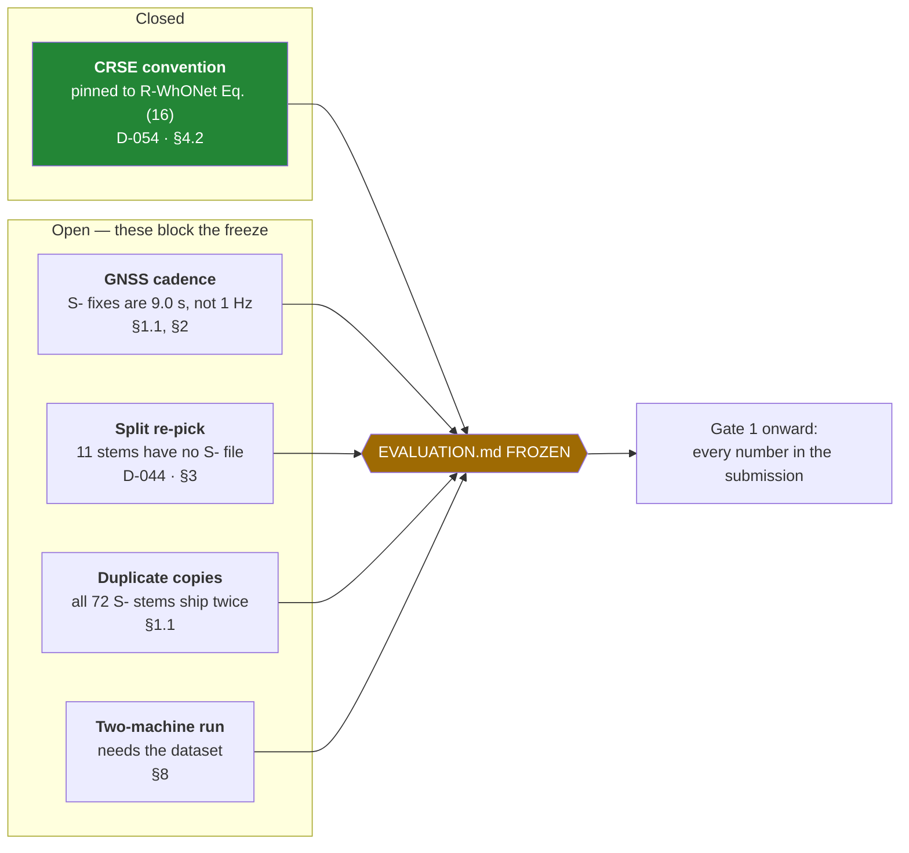
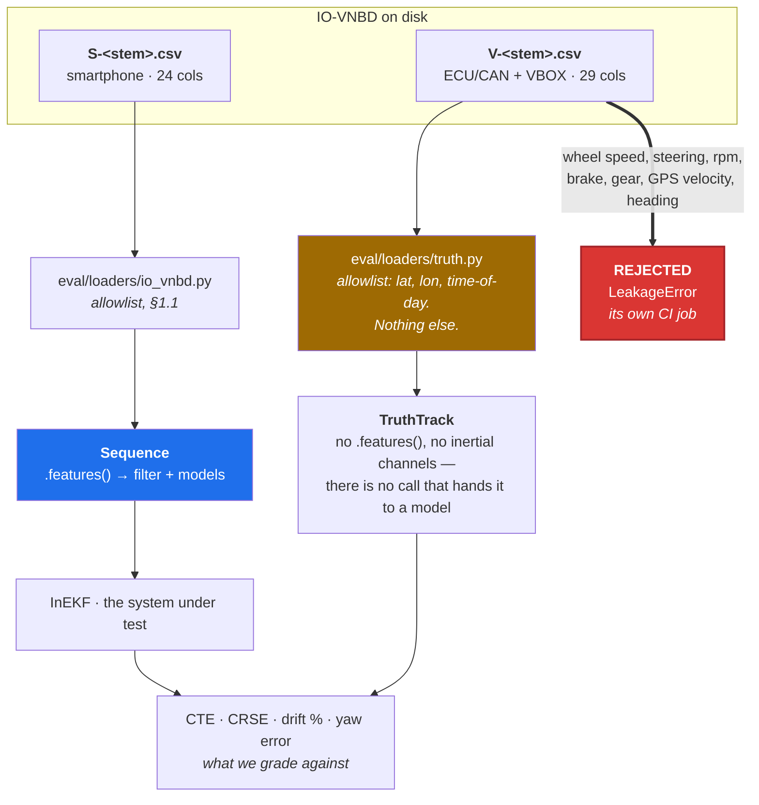
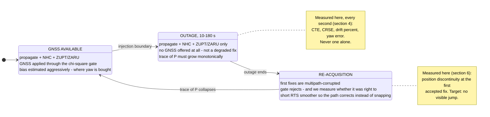

# Evaluation Protocol

**Status:** **DRAFT. The Gate 0 freeze date (Fri 28 Aug 2026) passed without the freeze.**
**Owner:** seat D. **Ratified by:** all six seats.
**Submission:** Tue 8 Sep 2026 (see DECISION_LOG D-021 — the schedule compressed on 26 Aug).

Four things still hold this document open. Each is marked ⚠️ where it appears below.



Once frozen, this document is the contract. Every number, table and plot in the submission is
produced by the harness described here. Changing anything below after freeze requires an entry in
[DECISION_LOG.md](DECISION_LOG.md) naming what changed, why, and which results were invalidated.

The point of freezing before any model trains is simple: a protocol that can move is a protocol that
will be moved, one small justified step at a time, until the numbers flatter us and mean nothing.

---

## 1. Input channels

### 1.1 Allowlist — IO-VNBD `S-` (smartphone) stream only

10 Hz inertial — measured, median Δt = 100.0 ms. Permitted columns:

| Group | Columns | Unit |
|---|---|---|
| Accelerometer | accel X / Y / Z | m/s² |
| Gravity | gravity X / Y / Z | m/s² |
| Gyroscope | gyro yaw / pitch / roll | rad/s |
| Magnetometer | magnetic X / Y / Z | µT |
| Orientation | orientation yaw / pitch / roll | deg |
| Time | time-since-start, date | ms |
| GNSS *(gated filter update only — see the box)* | lat, lon, altitude, speed, accuracy, orientation, sats-in-range | deg / m / km·h⁻¹ / m |

> ⚠️ **The `S-` GNSS is not 1 Hz. It is 9 s, and this document was drafted against the wrong
> number.** Measured across all 72 `S-` stems in the synchronised folder, the median inter-fix
> interval is **9.0 s**; only `Vta1a`, `Vta2` and `Vta1b` update at 1 Hz, and `Vw1` and `Vw15`
> contain **zero** GPS position changes. Consequences, in order of how much they hurt:
>
> - §4's CTE and CRSE are sums over **1 s epochs** and §3's prediction cadence is 1 s. Neither is
>   computable from a fix every 9 s without inventing positions between fixes.
> - On the held-out set as it stands: `S3a` carries 253 fixes over 2,462 s; `Vtb3` 35 fixes over
>   824 s at a 13.5 s median and a **109 s maximum gap**; `Vta11` 5 fixes over 51 s; `Vta9`
>   **one fix in 15.5 s**. A 10 s outage window spans about one fix, so drift %, CTE and CRSE are
>   not measurable on the challenging set from `S-` truth at all.
>
> The **`S-` GNSS keeps its role as the gated filter update** — it is the measurement a phone
> actually has, and the allowlist row above is unchanged. What moves is *ground truth*: see §2.
> Regenerate the measurement with `python -m eval.cadence --data-root data`.

> ⚠️ **Every `S-` stem ships twice, under two different checksums, and nothing yet says which copy
> is graded.** All 72 `S-` stems in the synchronised folder appear as two files; no `V-` stem does.
> Fifty-seven differ substantively — the uncategorised copy is larger every time, by up to **8.9%**
> (`S-vta24`) — and the remaining fifteen differ by a trailing newline. A percentage difference is
> *rows*, so sequence duration, outage tiling, fix count and every metric move with the choice.
> `eval.loaders.io_vnbd.load_split` took `candidates[0]` off a glob, which made filesystem ordering
> the arbiter and put two machines on the same commit onto different data — against §8's
> "reproduces to the digit across two machines". It is now deterministic (the categorised copy
> wins, matching the truth pairing) and quantified by `eval.loaders.truth.divergent_copies`.
> **Which copy the protocol should use is seat D's to settle before the freeze.**

### 1.2 Denylist — the `V-` (ECU/CAN) stream

**Wheel speed FL/FR/RL/RR is disallowed by PS 26168.** So is anything derived from it. The whole
`V-` stream is out of the feature path. `V-` GPS may be used **only** as ground truth on paired
sequences, and only where explicitly labelled as such in the plot caption.

### 1.3 Enforcement

- The dataloader carries an explicit column allowlist. Anything not on it raises.
- A CI test asserts that no tensor reaching a model or filter input was built from a column whose
  name matches `wheel|steer|rpm|engine|brake|clutch|gear|pedal|handbrake` or begins with `V-`.
- **The leakage audit runs twice:** once in Sprint 1, once again in the week before submission.
  A test that only ever ran when it was written is not a test.

There are exactly two doors into the data, and they lead to different places:



Three properties keep the truth door narrow, and each is pinned by a test: the allowlist is *lat,
lon and time of day* and nothing else — no GPS velocity, no heading, because a velocity column
here becomes a speed label the first time someone is short of one; columns are selected from the
header **before** the file body is read, so a wheel-speed column is never materialised in memory at
all; and `TruthTrack` is deliberately not a `Sequence`.

---

## 2. Frames and ground truth

| Item | Convention |
|---|---|
| Navigation frame | **NED** (North-East-Down) |
| Tracking | 2-D horizontal, **yaw-only** rotation R^n_b (pitch/roll zeroed for the position metric) |
| Body frame | Vehicle frame. Phone→vehicle rotation is **R_sv**. |
| Ground-truth displacement | **Vincenty's inverse geodesic formula** between truth fixes |
| Truth source | ⚠️ **PROPOSED, NOT RATIFIED** — the paired `V-` VBOX GPS, at a measured 10 Hz (median Δt 0.10 s). §1.2 already permits it as truth on paired sequences. Read through `eval/loaders/truth.py`. |
| Truth accuracy | ≈ ±3 m (VBOX) |
| Sample rate | **10 Hz inertial** (`S-`, measured); **9.0 s** `S-` GNSS fixes (measured, §1.1); **10 Hz** `V-` VBOX truth (measured) |

Never assume a nominal Δt. Use the recorded timestamps, and interpolate GNSS onto IMU epochs
rather than the reverse.

> ⚠️ **The truth source is a protocol change and it is not ratified.** This section was drafted as
> "1 Hz GNSS", which the `S-` stream does not deliver (§1.1). The `V-` VBOX track is the only
> 10 Hz positional reference in the dataset and §1.2 already permits it — but the code path
> (`eval/loaders/truth.py`, `eval/cadence.py`) has **never been run against real bytes**, because
> IO-VNBD is not on the machine it was written on. Two things are unverified, and both fail loudly
> rather than silently: the `V-` GPS lat/lon header spellings (`load_truth` raises listing the
> headers it saw if no alias matches) and the alignment residual itself.
>
> **The residual is the abort gate.** Two receivers quoted at ±3 m, differenced, should agree to a
> few metres; a misalignment of even one second puts ~16 m of motorway into the residual, so the
> check is sharp. If the paired `V-` track does not pass within ~3–10 m of the `S-` stream's own
> fixes at zero lag, sourcing truth there is **not sound**, and the protocol falls back to
> drift-%-only reporting.
>
> Run `python -m eval.cadence --data-root data` on a box that has the dataset. Until that residual
> exists, this row stays marked PROPOSED and no DECISION_LOG row records the change — a decision
> logged ahead of its evidence is the thing the log exists to prevent.

---

## 3. Outage injection

- Outage lengths: **10 / 30 / 60 / 120 / 180 s**.
- Sequences are **non-overlapping**, drawn from **held-out scenarios only**.
- Prediction cadence during an outage: **1 s**.
- 10 s outages are used for the challenging-scenario set; 30–180 s for the long-outage set.
- During an outage the filter receives **no GNSS update at all** — not a degraded one. The χ² gate is
  exercised separately on the re-acquisition transient (§6).

What the filter does across one injected window, and what is measured where:



### Held-out scenario sets

| Set | Sequences |
|---|---|
| **Long outage** (30/60/120/180 s) | V-St6, V-St7, V-S3a, Vtb3, Vfb01c, Vfb02a, Vta1a, Vfb02b, Vfb02g |
| **Roundabout** (10 s) | Vta11, Vfb02d |
| **Hard brake** (10 s) | Vw16b, Vw17, Vta9 |
| **Accel change** (10 s) | Vfb02e, Vta12 |
| **Sharp corner / SLR** (10 s) | Vw6, Vw7, Vw8 |
| **Wet road** (10 s) | Vtb8, Vtb11, Vtb13 |
| **Motorway (easy control)** (10 s) | Vw12 |

Training sets (≈1,590 min / 1,165 km): V-S1, V-S2, V-S3c, V-S4, V-St1, V-M, V-Y2, plus Vta/Vtb/Vw/Vfa/Vfb
subsets not listed above. **No sequence appears in both.** The split is fixed in code, not in a notebook.

**Mandatory position plots for the submission:** V-St6, V-St7, V-S3a (long outage) and at least one
roundabout scenario.

> ⚠️ **This table is the protocol as drafted from the paper, and it is not yet loadable.** The paper
> is written against the `V-` vehicle stream; we consume `S-` only. Eleven of the stems above —
> `St1`, `St6`, `St7`, `Y2`, `Vtb13`, `Vfb01c`, `Vfb02a`, `Vfb02b`, `Vfb02d`, `Vfb02e`, `Vfb02g` —
> have **no `S-` smartphone file** in either IO-VNBD folder. `eval/splits.py` is the authority and
> currently holds the loadable subset: long outage `S3a, Vtb3, Vta1a`; mandatory plots `S3a, Vta11`;
> train `S1, S2, S3c, S4, M`. **Seat D re-picks replacements and rewrites this table before the
> Gate 0 freeze** — see [DECISION_LOG.md](DECISION_LOG.md) D-044.
>
> **Still open on 5 Sep.** Until it is done the long-outage result rests on **three** sequences, and
> must be reported as resting on three — not on the nine this table names.

---

## 4. Metrics

Report all four. Never report one alone.

### 4.1 CTE — Cumulative True Error

The **signed** sum of per-second position errors over an outage. Signed, so systematic over- or
under-prediction shows up instead of cancelling into an RMS.

### 4.2 CRSE — Cumulative Root Square Error

**The sum of absolute per-second errors, `Σ|eᵢ|`.** Settled against the paper's own equations —
[DECISION_LOG.md](DECISION_LOG.md) D-054, superseding D-023.

R-WhONet (arXiv 2209.05877) **Eq. (16)**, verbatim:

```
CRSE = Σ_{t=1}^{N_t} √(e_pred²)
```

and **Eq. (17)**:

```
CTE = Σ_{t=1}^{N_t} e_pred
```

> "Where `N_t` is GNSS outage length, `e_pred` refers to the prediction error, and `t` represents
> the sampling period which we define as 1 second in this research."

The root is taken **per term, inside the sum**. CRSE is therefore the sum of absolute per-second
errors and not a root of any sum, and CTE is its signed counterpart — the two differ only by the
absolute value, which is exactly why they are reported as a pair. The original WhONet paper
(arXiv 2104.02581 §3.2) carries the same metrics at the same equation numbers.

Both papers' *prose* calls it "cumulative root mean squared", which the equation contradicts.
**The equation wins**, and the prose is why three documents in this repo described it as an RMS.

| Convention | Formula | Status |
|---|---|---|
| **`SUM_ABS`** *(default)* | Σ\|eᵢ\| | **Eq. (16). The paper's metric.** |
| `SUM_SQUARES` | √(Σ eᵢ²) | Retained; D-023's reading, kept so earlier working is reproducible |
| `RMS` | √(mean eᵢ²) | Retained; the reading the prose suggests |

**Confirmed arithmetically against WhONet's own tables** (§3 of [DATASETS.md](DATASETS.md), four
outage lengths × two methods). A CRSE that sums over `N_t` one-second epochs has a per-epoch error
rate of `CRSE / N_t`, which should be roughly flat across outage lengths. Only Eq. (16) makes it so:

| Divide published CRSE by | Physics spread | WhONet spread |
|---|---|---|
| `N_t` — the `SUM_ABS` reading | **1.4 %** | **2.3 %** |
| `√N_t` — the `SUM_SQUARES` reading | 2.4× | 2.4× |
| nothing — the `RMS` reading | 5.9× | 5.9× |

D-023 chose `SUM_SQUARES` from the 180 s row alone and labelled itself *"reasoned, not verified"*.
That argument never discriminated: `SUM_ABS` satisfies it too (13.67/180 ≈ 0.076 m per epoch beside
a signed sum of 2.90 m). It takes all four rows to separate the readings.

Implemented as `CrseConvention` in [`eval/metrics/core.py`](../eval/metrics/core.py). Every member
is branched on explicitly and an unknown one raises — there is no `else` fallthrough, because the
function previously ended in a bare `return √(mean(…))` and a new member added without a branch
would have silently computed RMS under the new name.

> **These are Onyekpe's definitions — Cumulative True Error and Cumulative Root Square Error.
> They are NOT cross-track error and NOT ATE.** The task brief mislabels them, and so does most
> secondary writing about this dataset. State the definition explicitly in the write-up.
>
> **R-4 is closed.** The equations above are quoted from the paper, not inferred, and the
> convention they fix is verified against the paper's published tables. Nothing was invalidated by
> the change: no CRSE had been computed on real data when it was made.

### 4.3 Drift as % of distance travelled — **this is what PS 26168 grades**

```
drift_% = ‖ p̂(T) − p(T) ‖₂ / L × 100
```

where `p̂(T)` is the estimated position at the end of the outage, `p(T)` the Vincenty ground truth,
and `L` the ground-truth path length travelled during the outage. Report **median and 95th
percentile** across sequences, not just the mean — the mean hides the tail, and the tail is what a
judge finds.

### 4.4 Yaw error — logged separately, always

`ψ̂(t) − ψ(t)`, wrapped to (−π, π], reported as RMS and max over each outage. This is the dominant
error term ([ERROR_BUDGET.md](ERROR_BUDGET.md)); a run that reports position error without yaw error
is not a complete result.

---

## 5. Baselines

| Baseline | What it is | Why it exists |
|---|---|---|
| **Raw strapdown INS** | Double-integrated accel, integrated gyro, no constraints | The floor. Shows the problem is real. |
| **Onyekpe "Learning to Localise" INS** | 1 s window, MAE, Adamax 7e-4, batch 128, dropout 0.05, ~72-unit RNN | **The honest phone-grade number to beat.** Reproduced in Sprint 1. |
| **Physics-only InEKF** | InEKF + NHC + ZUPT/ZARU, no learning, Q from Allan variance | Gate 1. Must land within 3–5× of the GNSS-available baseline over 60 s. |
| **GNSS-available** | Filter with `S-` GNSS updates applied throughout | The ceiling for this sensor set. |

> ⚠️ **State the update count beside the Gate 1 ratio.** "Physics-only within 3–5× of
> GNSS-available" reads as a comparison against a filter that gets a fix every second. At the
> measured 9.0 s cadence (§1.1) it is roughly **7 updates in a 60 s window, not 60** — so the
> denominator is weaker than the criterion assumes and the band is easier to hit for a reason that
> has nothing to do with the filter. Moving *truth* to the `V-` stream does not fix this: §1.2
> permits `V-` GPS as truth only, and a filter fed 10 Hz VBOX GPS would be modelling hardware the
> phone does not have. Report the ratio **and** the update count, every time.

**Reference-only, never quoted as ours:** AI-IMU 1.10% (KITTI, automotive-grade IMU) and
WhONet ~0.15% (wheel speed, disallowed here). Both appear in the write-up as context with the
sensor-grade caveat attached, or not at all.

---

## 6. Re-acquisition behaviour

Measured, not assumed:

- Position discontinuity at the first accepted GNSS fix after an outage (metres). Target: no visible jump.
- χ² gate behaviour on tunnel-exit multipath — how many fixes were rejected, and were they right to be.
- Covariance trace through the outage: must grow monotonically during, collapse on re-acquisition.

---

## 7. Reporting rules

1. **Every figure and table is stamped with the git commit SHA and RNG seed that produced it.**
   A result whose provenance is unknown is deleted, not debugged.
2. **One command regenerates every figure in the submission.** If it takes manual steps, it will
   drift from the numbers in the text.
3. Fixed seeds; report the seed. Where variance matters, report across ≥3 seeds.
4. Report **both** WhONet outage-sequence counts (809/399/197/129 from its intro,
   688/342/168/111 from its tables) and note the inconsistency ourselves. The paper also prints an
   identical 120 s CTE of 1.78 m for both methods, which is likely a typo. Cite the tables.
   Finding this before a judge does is worth more than the half-mark it costs.
5. Every plot caption names its data stream (`S-` or `V-`) explicitly. The phone stream is 10 Hz —
   we cannot demonstrate a 200 Hz pipeline on it and must not imply we did.

---

## 8. Gate criteria

| Gate | Date | Criterion | Status at 5 Sep |
|---|---|---|---|
| **0** | Fri 28 Aug | Harness reproduces to the digit across two machines. Metric equations pinned. Split fixed in code. | **NOT CLOSED.** Equations pinned (D-054) and the split is in code (D-044); the cadence (§1.1), the copy choice (§1.1), the split re-pick (§3) and the two-machine run are all open. `pytest` is also not green on the primary Windows box. |
| **1** | Tue 1 Sep | Physics-only InEKF within **3–5×** of the GNSS-available baseline over 60 s outages, **and the update count reported beside the ratio** (§5). **Hard stop** — no network before this clears. | **BLOCKED.** Full-state NEES is 29.90 against a [16.843, 19.195] band — over-confident, ZARU is the cause (D-053). Neither baseline exists yet and `eval/run.py` is unwired. |
| **2** | Fri 4 Sep | Speed head calibrated: **≥95% of speed errors inside ±2σ** of the predicted variance. | Not started; cannot start before Gate 1 clears. |
| **3** | Mon 7 Sep | Full sweep, all plots, write-up, deck, video. **Submit Tue 8 Sep by midday.** | Not started. [METHOD.md](METHOD.md) is still a skeleton. |

If Gate 1 fails, diagnose in this order: **timestamps → NHC gating conditions → process noise →
ZUPT thresholds.** Do not add model capacity to a broken spine.
