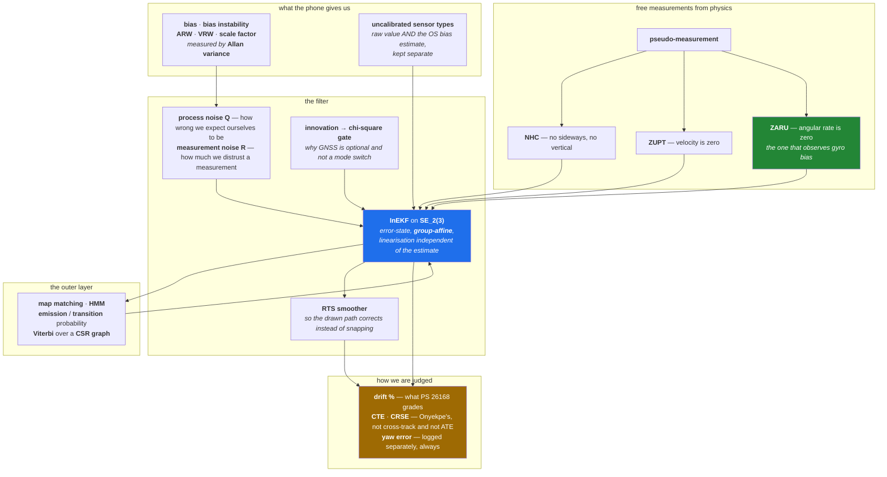

# Glossary

Read once. It saves the six of us from talking past each other for three weeks.

How the terms hang together — the whole system in one picture, with the jargon attached to the
place it is used:

---

## Navigation

**Dead reckoning (DR)** — Estimating where you are now from where you were, plus how fast and in
what direction you have been moving. No external reference.

**Strapdown INS** — The naive version: integrate the gyroscope to get heading, integrate the
accelerometer twice to get position. Fails within seconds on a phone. Our floor baseline.

**NED** — North-East-Down. The navigation frame IO-VNBD uses and the one we track in.

**Body / vehicle frame** — Axes fixed to the car. Forward, lateral, down.

**R_sv** — The rotation from the **s**martphone frame to the **v**ehicle frame. Unknown, possibly
time-varying, and it must be known to about 1° ([ERROR_BUDGET.md](ERROR_BUDGET.md) §5).

**Vincenty's inverse formula** — Geodesic distance between two lat/lon points on the ellipsoid.
How IO-VNBD computes true displacement between GNSS fixes, and therefore how we compute ground truth.

**Lever arm** — The physical offset between the IMU and the point whose position you are reporting.

---

## Filtering

**EKF** — Extended Kalman Filter. Tracks a best estimate *and* how uncertain it is, linearising a
nonlinear system about the current estimate.

**Error-state EKF** — Tracks the small *correction* to the estimate rather than the estimate itself.
Numerically much better behaved for navigation, because the small quantity is the one being linearised.

**InEKF** — Invariant EKF. The state (rotation, velocity, position) is treated as living on a Lie
group. Because the dynamics are **group-affine**, the invariant error obeys a log-linear equation
whose linearisation **does not depend on the current estimate**. Consequences: consistent covariance
(a naive EKF can falsely believe it observes yaw), a large convergence basin from a badly wrong
start, and easier tuning. This is why an arbitrary phone mount is survivable.

**SE₂(3)** — The matrix Lie group of "double direct isometries" holding rotation, velocity and
position together in one object. Our state, augmented with gyro/accel biases and R_sv.

**Group-affine** — The property of the dynamics that makes the InEKF's log-linear error property hold.

**Process noise Q** — How much the filter expects its own prediction to be wrong per unit time. We
seed it from an Allan-variance run rather than guessing.

**Measurement noise R** — How much the filter distrusts an incoming measurement. `R_NHC` is the one
the AI-IMU network learns to modulate.

**Innovation** — The difference between a measurement and what the filter predicted for it. The
quantity a gate tests.

**χ² gate (Mahalanobis gate)** — A statistical test on the innovation that rejects measurements
inconsistent with the current state and covariance. This is what makes GNSS "optional" instead of a
mode switch: in a tunnel nothing passes the gate, so nothing is applied, and there is no code path
to switch.

**RTS smoother** — Rauch–Tung–Striebel. A backward pass that retro-corrects a trajectory using
later information. We run a short one over the outage window so the *displayed* path corrects
smoothly on tunnel exit instead of snapping.

**Pseudo-measurement** — A measurement you invent from physics rather than read from a sensor. NHC
and ZUPT are pseudo-measurements.

---

## Constraints

**NHC — Non-Holonomic Constraint** — "This car cannot move sideways or vertically." Fed to the filter
as a measurement of zero lateral and zero vertical body-frame velocity. Free accuracy, and the single
biggest reason the 10% target is reachable. Must be **gated off** during slips, drifts and reversing.

**ZUPT — Zero-velocity update** — When the car is detected stationary (traffic light), tell the
filter velocity = 0. Resets velocity error and observes accelerometer bias.

**ZARU — Zero angular-rate update** — When stationary, tell the filter angular rate = 0. This is how
gyro bias gets observed, and gyro bias is the enemy. Apply at **every** detected stop.

---

## Sensors

**Bias** — A constant offset a MEMS sensor reports when nothing is happening. Gyro bias is the
dominant error term in this whole project.

**Bias instability** — How much that offset itself wanders. The flat minimum of the Allan deviation
curve. Quoted in °/hr for gyros.

**ARW — Angular Random Walk** — Heading uncertainty accumulated from white gyro noise, growing as
√t. Quoted in °/√hr. Read from the −½ slope of the Allan deviation at τ = 1 s. At our 60 s
timescale it is roughly an order of magnitude smaller than residual bias.

**VRW — Velocity Random Walk** — The accelerometer equivalent.

**Scale-factor error** — The sensor reads 1.02× the true rate. Invisible when still, expensive
during turns.

**g-sensitivity** — A gyro reading that changes with linear acceleration. Usually unspecified on
phone parts.

**Allan variance** — The standard procedure for characterising an IMU: log it stationary for hours,
compute the overlapping Allan deviation σ(τ), and read the noise terms off the slopes. Procedure in
[ERROR_BUDGET.md](ERROR_BUDGET.md) §9.

**Uncalibrated sensor types** — `TYPE_ACCELEROMETER_UNCALIBRATED` / `TYPE_GYROSCOPE_UNCALIBRATED` on
Android return the raw value **and** the OS's bias estimate in separate fields. We need them separate,
because the filter estimates bias as a state and double-compensation corrupts it.

**FOG** — Fibre-Optic Gyroscope. Navigation grade, 1–3 orders of magnitude better than a phone MEMS,
and the target sensor for the edge-engine build.

---

## Map matching

**Map matching** — Snapping a noisy trajectory onto a road network.

**HMM formulation (Newson & Krumm, 2009)** — Hidden states are candidate road segments near each
observation. **Emission probability** is Gaussian in the distance from the estimate to the candidate
road. **Transition probability** penalises the mismatch between straight-line distance and on-road
route distance between consecutive points.

**Viterbi** — The dynamic-programming algorithm that decodes the most likely sequence of hidden
states. **Sliding-window / online Viterbi** commits states older than a lookback window (~5–10 s for
us) and keeps recent ones tentative.

**CSR graph** — Compressed Sparse Row adjacency. The compact in-memory road graph format we build
from an OSM `.pbf` extract.

**`.pbf`** — The binary OSM extract format. Geofabrik publishes regional ones.

---

## Metrics

**CTE — Cumulative True Error** — The **signed** sum of per-second position errors over an outage.
**Not cross-track error.** The task brief mislabels it.

**CRSE — Cumulative Root Square Error** — the **sum of absolute** per-second position errors,
`Σ|eᵢ|` (R-WhONet Eq. 16). The root is taken per term, inside the sum, so this is not an RMS and
not a root of any sum — the papers' prose says "root mean squared" and their equation does not.
See D-054. **Not ATE.**

**ATE — Absolute Trajectory Error** — Used in the pedestrian-odometry literature. We do not use it,
and pedestrian ATE figures in metres are **not comparable** to vehicle drift percentages.

**Drift %** — Final position error divided by distance travelled. **This is what PS 26168 grades.
Under 10%.**

---

## Methods worth knowing by name

**AI-IMU (Brossard 2020)** — A small CNN adjusts the noise covariance of NHC pseudo-measurements
inside an Invariant EKF. 1.10% translational error on KITTI, IMU only. **Copy this architecture.**
Caveat: KITTI's IMU is automotive grade, not a phone.

**Onyekpe "Learning to Localise" (Appl. Sci. 2021)** — RNN/LSTM/GRU correcting INS displacement and
orientation-rate error on IO-VNBD. Up to 89.6% / 93.4% improvement over raw INS. **This is our
official baseline** and the honest phone-grade reference point.

**TLIO (2020)** — Small ResNet regressing 3D displacement *and its covariance*, fused tightly into
an EKF. Framework yes, weights no — it is pedestrian.

**EqNIO (ICLR 2025)** — Makes the network mathematically invariant to how the device is rotated
about gravity. The principled answer to "phone mounted at any angle". On the cut list, but the idea
is the right one.

**AirIMU / AirIO** — Learned IMU correction plus preintegration uncertainty; AirIO shows body-frame
input beats world-frame by a wide margin. Take the body-frame lesson and the uncertainty head.

**WhONet / R-WhONet** — An ~8.2k-parameter RNN correcting **wheel-speed** odometry. ~0.15% of
distance. **Not a legal solution here** — quote only as the ceiling we cannot reach without OBD.

**VeTorch / Cortés–Solin** — CNN/TCN regressing vehicle forward speed from phone IMU, fed to an EKF
as a constraint. This is our speed block.

**RoNIN, IONet, RIDI, IDOL, CTIN, iMoT** — Pedestrian inertial odometry. They learn a walking-gait
prior (0.5–2 m/s). A car at 16.7 m/s is off-distribution and they under-predict badly. Architectures
only, never weights.
