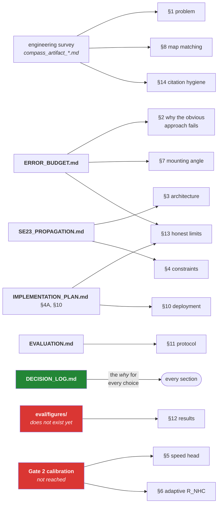

# Method

**Status:** ⚠️ **still a skeleton — all fifteen sections `[TODO]` with three days to submission.**
This is the largest unstarted deliverable in the repo. **Owner:** seat C, with each section drafted
by the seat that built the thing.

The advice below — *fill sections as the work lands, not in the last week* — was not taken, and the
last week is now. The mitigation is that almost nothing here needs to be *invented*: eleven of the
fifteen sections have a source document that already contains the substance, and the job is
compression and honesty rather than authorship. Sections 5, 6 and 12 are the exceptions, because
they need results that do not exist yet.

Markers: `[TODO]` not started · `[DRAFT]` first pass exists · `[LOCKED]` reviewed, do not churn.

**Write §13 first.** It is the section that is finished today — every limitation in it is already
known and written down elsewhere — and it is the one that is never cut.

---

## 1. Problem and framing — `[TODO]` *(C)*

GNSS-denied ground-vehicle navigation. Grade metric: position drift under 10% of distance travelled.
State the operating cases explicitly and in order of confidence: road tunnels and underpasses
(central case), urban canyons, multi-level car parks (hardest, least certain).

## 2. Why the obvious approach fails — `[TODO]` *(S)*

Double-integrated accelerometer bias: 10 mg ≈ 176 m in 60 s, before any noise. Lead with this — it
justifies every architectural choice that follows. Material in [ERROR_BUDGET.md](ERROR_BUDGET.md) §2.

## 3. Architecture — `[TODO]` *(S)*

One continuously-running error-state Invariant EKF on SE₂(3) + biases + R_sv. IMU always propagates;
GNSS is a χ²-gated optional correction.

**Make the central argument explicitly:** because there is only one filter and no mode switch, the
"seamless transition within milliseconds" requirement is met **by construction**. There is no code
path to switch, so there is no latency to measure and no jump to hide. Contrast with the two-system
design a reader will assume we built.

Include the block diagram. Include the state vector, written out.

**Source:** [SE23_PROPAGATION.md](SE23_PROPAGATION.md) §2–5. Take the state layout and `A_RI`
from there verbatim. §4 has the group-affine caveat to state honestly rather than overclaim, and
§6 has the argument for the right-invariant error — the zero attitude column in §7.1 is the single
most defensible technical point we have; make it in this section.

## 4. Kinematic constraints — `[TODO]` *(S)*

NHC, ZUPT, ZARU: what each observes, and — the part that is usually left out — **the gating
conditions under which each is switched off**. An ungated NHC during a slip is worse than no NHC.

**Source:** [SE23_PROPAGATION.md](SE23_PROPAGATION.md) §7.1–7.3 derives what each one actually
observes. The honest and non-obvious point: NHC gives **no instantaneous heading information** —
yaw reaches it only through the gravity coupling, slowly and only while accelerating — which is
why ZARU, a direct observation of gyro bias, matters more for the dominant error term.

## 5. Learned forward speed — `[TODO]` *(M)*

Backbone, input representation (body-frame, per AirIO), window length, output = speed **and
variance**. Why the variance head matters as much as the mean: the filter needs to know how much to
trust the estimate, and a confidently wrong covariance is worse than a noisy mean.

Calibration evidence from Gate 2 goes here.

## 6. Learned adaptive constraint covariance — `[TODO]` *(M)*

AI-IMU's mechanism: a ~6k-parameter CNN outputting R_NHC per step, relaxing the lateral constraint
during hard cornering and tightening it on straights. State the parameter count — it is a
surprisingly strong point that the highest-leverage learned component is this small.

## 7. Mounting-angle estimation — `[TODO]` *(S)*

R_sv in the filter state, observable through turns under NHC; PCA on horizontal acceleration during
straight-line accel/brake as an initialiser only. Mount-disturbance detector re-inflates the
covariance. Derive the ~1° requirement from the error budget so the reader sees why this is not
optional.

**Source:** [SE23_PROPAGATION.md](SE23_PROPAGATION.md) §7.2 makes the observability claim
quantitative: the NHC rows observe mount yaw and pitch with **gain equal to forward speed**. That
gives the section its figure (σ(ξ_sv,z) against speed) and, at zero speed, states the car-park
limitation (D-016) as a property of the math rather than an apology.

## 8. Map matching — `[TODO]` *(P)*

Online HMM over an offline OSM CSR graph. **The adaptation worth emphasising: emission σ comes from
the filter's own covariance, not from an assumed GPS noise model** — we already compute the
uncertainty, so a matcher tuned for raw-GPS noise is throwing information away. Sliding-window
Viterbi committing segments older than ~5–10 s.

Include the Indian-context failure mode: flyover-vs-service-road tagging ambiguity in OSM.

## 9. Car-park mode — `[TODO]` *(P)*

No road graph exists underground. Tight NHC + barometer floor detection (a level ≈ 2.5–3 m ≈
0.3–0.36 hPa) + ramp detection from sustained pitch. **This section says plainly that drift may
exceed 10% on a long stay.** See §13.

## 10. Deployment — `[TODO]` *(A, S)*

One C++/Rust core, two frontends: JNI to Android, and the identical library as the 200 Hz FOG edge
engine. Android specifics: foreground service, uncalibrated sensor types, real timestamps,
`HIGH_SAMPLING_RATE_SENSORS`, threading model. Export path: FP16, with the covariance-head
degradation test.

The "edge deployable engine" requirement is satisfied by construction, not as a second project.

## 11. Evaluation protocol — `[TODO]` *(D)*

Condense [EVALUATION.md](EVALUATION.md). State the channel restriction and the CI test that enforces
it **before** presenting any number — a reader who wonders whether we used wheel speed will not
believe anything after that point.

Define CTE and CRSE explicitly as Cumulative True Error and Cumulative Root Square Error, and note
that they are commonly mislabelled as cross-track error and ATE.

## 12. Results — `[TODO]` *(D)*

Baselines, then ours. Mandatory plots: **`S3a` and `Vta11` (the roundabout)** — `eval/splits.py` is
the authority, and `St6`/`St7` are not available to us at all because they ship on the `V-` stream
only (D-044). Drift % as median and 95th percentile. Yaw error separately. Every figure stamped
with commit and seed.

**Say how many sequences each number rests on.** The long-outage result currently rests on three,
not the nine the protocol was drafted with, and the reader should learn that from us.

Include the domain-shift ablation (train IO-VNBD → test Delhi/NCR) if the collection lands. Almost
no other team will submit one.

## 13. Honest limits — `[TODO]` *(C)* — **never cut**

- Car parks are the least certain claim in the whole submission. Say so here, first.
- Phone `S-` data is 10 Hz; the 200 Hz pipeline is demonstrated on the edge build, not on this data.
- Where our numbers are worse than published wheel-odometry or automotive-IMU results, say why:
  different sensor grade, different permitted inputs.
- Any hyperparameter the source papers did not state, which we therefore chose ourselves.
- **The long-outage result rests on three sequences, not nine.** Eleven stems in the protocol as
  drafted have no `S-` smartphone file (D-044). Say the count beside the number.
- **The `S-` GNSS updates every ~9 s, not 1 Hz.** State where ground truth came from and why, and
  state the GNSS-available baseline's actual update count beside the Gate 1 ratio
  ([EVALUATION.md](EVALUATION.md) §1.1, §5).
- **Bias instability is reported as an upper bound**, and the two bias driving noises are *derived*
  from a Gauss–Markov model rather than measured — the longest stationary segment in the dataset is
  507 s, which is too short for the +½ slope ([ERROR_BUDGET.md](ERROR_BUDGET.md) §9.2).
- **The mount block of `Q` is zero (D-048)**, so the ~1° mount requirement rests on the PCA
  initialiser alone. That is a stated limitation, not a modelled term.
- **If the filter ships with the consistency failure open** (D-053), say so and say what it means:
  an over-confident covariance is invisible in a position plot but is read by the χ² gate, the
  uncertainty ellipse and the map matcher's emission σ.

A limitation we state costs a fraction of what one a judge finds costs.

## 14. Citation hygiene — `[TODO]` *(C)*

- **AI-IMU's 1.10%** is KITTI's automotive-grade IMU. Not a phone result. Never quoted as ours.
- **WhONet's ~0.15%** requires wheel speed, which is disallowed here. Ceiling only.
- **Our honest reference point is the Onyekpe INS numbers** on IO-VNBD `S-` channels.
- Pedestrian ATE figures (RoNIN, TLIO) rank architectures; they do not predict car performance and
  are not comparable to drift %.
- WhONet's outage-sequence counts are internally inconsistent (809/399/197/129 in the intro vs
  688/342/168/111 in the tables) and it reports an identical 120 s CTE for both methods. Cite the
  tables and note the discrepancy ourselves.
- 2025–26 preprints (FTIN, IONext, GNIO, MosaicIMU, SNN+InEKF) have little independent replication.
  Treat their headline numbers as provisional if cited at all.

## 15. References — `[TODO]` *(C)*

Maintain as you write, not at the end.
