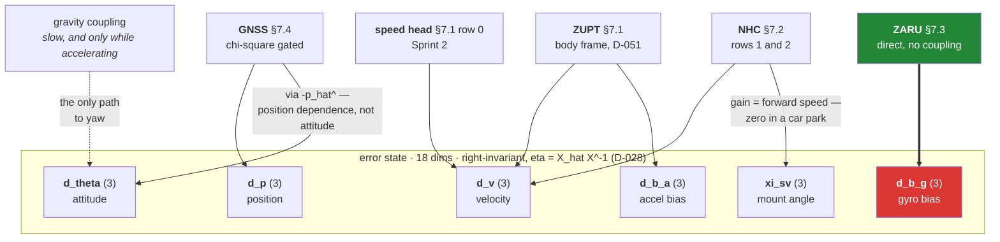
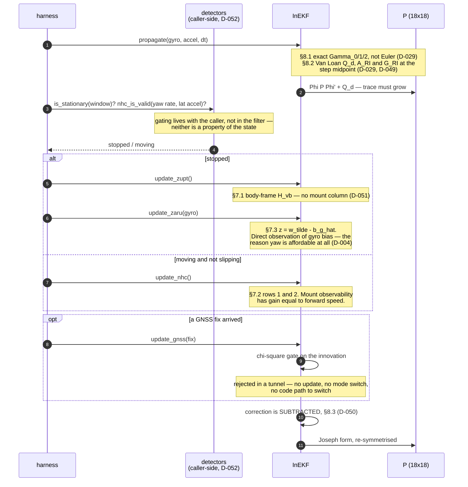

# SE₂(3) Propagation — the derivation the code is written from

**Seat S · Sprint 0 · 26 Aug 2026.** Status: **derived and numerically verified; not yet
implemented.**

`core/reference/inekf.py` raises `NotImplementedError` for `propagate()` and the update family
(D-025). This document is what that code gets written from in Sprint 1. It exists because a filter
transcribed from memory produces a system that runs, looks plausible, and is undebuggable — and
because Gate 1 is a hard stop that we do not get to retry.

Everything below is derived, not recalled. Where a result is quoted rather than derived it says so.

**Every matrix here is checked in CI** by [`tests/test_se23_derivation.py`](../tests/test_se23_derivation.py)
against a numerical ground truth — 107 cases. Writing those checks changed three things in this
document; each is marked **[verified]** where it appears. The derivation is protected before the
code that consumes it exists, which is the only order that works when the consumer is a filter.

Related: [ERROR_BUDGET.md](ERROR_BUDGET.md) (why yaw dominates), [GLOSSARY.md](GLOSSARY.md),
[DECISION_LOG.md](DECISION_LOG.md) D-002, D-004, D-006, D-028–D-031.

---

## 1. Conventions — fix these once

Every sign error in an INS traces back to a convention nobody wrote down.

| Symbol | Meaning |
|---|---|
| **NED** | Navigation frame. x North, y East, **z Down**. |
| `R` | Rotation **navigation ← body**. A body vector `x_b` becomes `R x_b` in NED. |
| `g` | `GRAVITY_NED = [0, 0, +9.80665]`. Positive because down is +z. |
| `ã`, `ω̃` | **Raw** IMU readings. `ã` is *specific force*, not acceleration. |
| `â = ã − b̂_a`, `ω̂ = ω̃ − b̂_g` | Bias-corrected inputs. |
| `(·)^∧` | `R³ → so(3)`, `a^∧ b = a × b`. Note `a^∧ b = −b^∧ a` — used constantly below. |
| `Δt` | **Measured** interval from real timestamps. Never nominal (D-013). |
| `R_sv` | Rotation **vehicle ← body(phone)**. `v_veh = R_sv Rᵀ v`. |

Specific force means `a = R f + g` with `f` the accelerometer reading — the accelerometer measures
everything *except* gravity, so gravity is added back, not subtracted. With `g` positive-down in
NED, a phone at rest reads `f ≈ [0,0,−9.81]` in a z-up body frame and the two cancel.

---

## 2. The state and the group

Nominal state, matching the error-state layout already frozen in `inekf.py`:

```
X = ⎡ R  v  p ⎤ ∈ SE₂(3)      b_g ∈ R³      b_a ∈ R³      R_sv ∈ SO(3)
    ⎢ 0  1  0 ⎥               (gyro bias)   (accel bias)  (mount)
    ⎣ 0  0  1 ⎦   (5×5)
```

The 18-dimensional error state that `P` is written over, and what observes each block:



`ξ_sv` uses the vehicle-frame left-multiplied convention (D-030) precisely so that `ξ_sv,z` reads
directly as mount-yaw error in degrees, comparable against the ~1° requirement in
[ERROR_BUDGET.md](ERROR_BUDGET.md) §5 without a change of basis. The gyro-bias block is coloured
because it is the dominant error term *and* the block that is currently inconsistent (§10).

SE₂(3) — the "double direct isometry" group — is the group of 5×5 matrices of that shape. It
exists because `SE(3)` has room for one translation column and inertial navigation needs two
(velocity **and** position) that transform the same way under a rotation. Its inverse is

```
X⁻¹ = ⎡ Rᵀ  −Rᵀv  −Rᵀp ⎤
      ⎢ 0    1     0   ⎥
      ⎣ 0    0     1   ⎦
```

The Lie algebra element for `ξ = (ξ_R, ξ_v, ξ_p) ∈ R⁹` is

```
ξ^∧ = ⎡ ξ_R^∧  ξ_v  ξ_p ⎤
      ⎢  0      0    0  ⎥
      ⎣  0      0    0  ⎦
```

### 2.1 The adjoint — derived, because §6 depends on it

`Ad_X ξ` is defined by `X ξ^∧ X⁻¹ = (Ad_X ξ)^∧`. Multiplying out:

```
X ξ^∧ X⁻¹ = ⎡ R ξ_R^∧ Rᵀ   −R ξ_R^∧ Rᵀ v + R ξ_v   −R ξ_R^∧ Rᵀ p + R ξ_p ⎤
```

Using `R S^∧ Rᵀ = (RS)^∧` and then `−(Rξ_R)^∧ v = v^∧ (Rξ_R)`:

```
        ⎡ R      0   0 ⎤
Ad_X =  ⎢ v^∧R   R   0 ⎥          Ad_{X⁻¹} = (Ad_X)⁻¹
        ⎣ p^∧R   0   R ⎦
```

Biases and `R_sv` are not part of the group; they append with identity blocks.

---

## 3. Continuous dynamics

```
Ṙ    = R (ω̃ − b_g − w_g)^∧
v̇    = R (ã − b_a − w_a) + g
ṗ    = v
ḃ_g  = w_bg                    (random walk)
ḃ_a  = w_ba                    (random walk)
Ṙ_sv = R_sv (w_sv)^∧           (random walk only — no deterministic dynamics)
```

`R_sv` has no dynamics because a mount does not move on its own. It moves when the phone is
knocked, which is a *jump*, not a drift — handled by re-inflating its covariance block on
`detect_mount_disturbance()`, not by carrying a large `w_sv` the whole drive.

---

## 4. Group-affine — and the caveat that matters

With perfect inputs (`b_g = b_a = 0`, no noise) the SE₂(3) IMU dynamics are **group-affine**:
`f(XY) = f(X)Y + X f(Y) − X f(I)`. That is the Barrau–Bonnabel condition, and it is why this
filter is worth the trouble: it makes the *error* dynamics autonomous — independent of the state
estimate — which is what removes the false yaw observability a naive EKF acquires (D-002).

**The caveat, stated up front because a judge will ask.** Adding `b_g`, `b_a` and `R_sv` to the
state **breaks exact group-affineness**. What survives, and what §5 shows explicitly, is that the
9×9 attitude/velocity/position block of `A` stays state-independent; the state dependence enters
only through the *bias-coupling columns*. This is the standard "imperfect InEKF" (Barrau &
Bonnabel 2018; Hartley et al. 2020) and it is the version everyone actually ships, because a
filter without bias states is not a filter for a phone IMU.

So the honest claim in the write-up is: *the dominant block retains the invariance property; the
bias coupling is a first-order approximation.* Not "the error dynamics are exactly state
independent."

---

## 5. Error definition and the linearised dynamics

Two choices exist. **Right-invariant** `η_R = X̂ X⁻¹` and **left-invariant** `η_L = X⁻¹ X̂`, with
`ξ = Log(η)`. They are related by the adjoint: `ξ_R = Ad_{X̂} ξ_L`.

We carry the **right-invariant** error (D-028). §6 gives the reason; here is what it costs and buys.

### 5.1 Derivation of the right-invariant error dynamics

Write `η_R = X̂X⁻¹`, whose blocks are `δR = R̂Rᵀ`, `ζ_v = v̂ − δR v`, `ζ_p = p̂ − δR p`. Let
`δb_g = b̂_g − b_g` and `δb_a = b̂_a − b_a`, so `ω̂ = ω − δb_g` and `â = a − δb_a`.

**Attitude.**

```
d/dt(δR) = R̂ ω̂^∧ Rᵀ − R̂ ω^∧ Rᵀ = R̂(ω̂ − ω)^∧ Rᵀ = R̂(−δb_g)^∧ Rᵀ = (−R̂ δb_g)^∧
⇒  ξ̇_R = −R̂ δb_g
```

With no bias error, `ξ̇_R = 0` — **the right-invariant attitude error is exactly constant under
propagation.** That is the whole point of the construction.

**Velocity.**

```
ζ̇_v = (R̂â + g) − ξ̇_R^∧ v − δR(Ra + g)
     = R̂a − R̂δb_a + g − ξ̇_R^∧ v − R̂a − δR g        [since δR·R = R̂]
     = (I − δR)g − R̂δb_a + (R̂δb_g)^∧ v
     = g^∧ ξ_R − R̂ δb_a − v^∧R̂ δb_g
```

using `(I − δR)g ≈ −ξ_R^∧ g = g^∧ ξ_R`.

**Position.**

```
ζ̇_p = v̂ − ξ̇_R^∧ p − δR v = ζ_v + (R̂δb_g)^∧ p = ζ_v − p^∧R̂ δb_g
```

### 5.2 The matrix

Ordering is `[ξ_R, ξ_v, ξ_p, δb_g, δb_a, ξ_sv]`, exactly the `IDX_*` slices in `inekf.py`:

```
        ⎡  0     0   0   −R̂        0    0 ⎤   ξ_R
        ⎢ g^∧    0   0   −v̂^∧R̂    −R̂    0 ⎥   ξ_v
A_RI =  ⎢  0     I   0   −p̂^∧R̂     0    0 ⎥   ξ_p
        ⎢  0     0   0     0        0    0 ⎥   δb_g
        ⎢  0     0   0     0        0    0 ⎥   δb_a
        ⎣  0     0   0     0        0    0 ⎦   ξ_sv
```

Read the top-left 9×9: it contains `g^∧` and `I` and nothing else. **No `R̂`, no `v̂`, no `ω`, no
`â`.** That block is the same matrix on a straight motorway and mid-roundabout, at any heading,
however wrong the current attitude estimate is. Every state dependence sits in the `δb_g`/`δb_a`
columns — §4's caveat, made concrete.

For reference, the left-invariant form (**not** what we carry) is input-dependent instead:

```
        ⎡ −ω̂^∧   0     0     −I   0  0 ⎤
A_LI =  ⎢ −â^∧  −ω̂^∧   0      0  −I  0 ⎥      (pose block; bias rows zero)
        ⎣  0      I    −ω̂^∧   0   0  0 ⎦
```

### 5.3 Noise mapping

With `w = [w_g, w_a, w_bg, w_ba, w_sv] ∈ R¹⁵`, the noise enters exactly where `δb_g`, `δb_a` do
(same algebra, `w_g` in place of `δb_g`):

```
        ⎡ −R̂       0     0  0  0 ⎤
        ⎢ −v̂^∧R̂   −R̂    0  0  0 ⎥
G_RI =  ⎢ −p̂^∧R̂    0     0  0  0 ⎥
        ⎢  0        0     I  0  0 ⎥
        ⎢  0        0     0  I  0 ⎥
        ⎣  0        0     0  0  I ⎦
```

`Q_c = diag(σ_g² I₃, σ_a² I₃, σ_bg² I₃, σ_ba² I₃, σ_sv² I₃)`, from `FilterConfig`.

**Units — the classic silent error.** `FilterConfig` stores PSD amplitudes: `gyro_arw` in
rad/s/√Hz, `accel_vrw` in m/s²/√Hz, `gyro_bias_rw` in rad/s²/√Hz, `accel_bias_rw` in m/s³/√Hz.
Datasheets and the Allan-variance convention in [ERROR_BUDGET.md](ERROR_BUDGET.md) §9 quote ARW in
°/√hr. Convert **once**, at the config boundary, with the conversion written next to the number:

```
σ_g [rad/s/√Hz] = ARW [°/√hr] × (π/180) / 60
```

A factor-of-60 error here is invisible — the filter still runs, just with a confidence wrong by
3600× in variance. Sprint 1 asserts a round-trip conversion test.

---

## 6. Why right-invariant, given a mixed measurement set

The invariance property only pays off if the *measurement* Jacobian is also state-independent, and
the two error conventions pair with opposite observation families:

| Observation form | Example here | Autonomous under |
|---|---|---|
| `Y = X⁻¹ b` | body-frame velocity → **NHC, ZUPT, learned speed** | right-invariant |
| `Y = X b` | world-frame position → **GNSS** | left-invariant |

*(Check: with `b = (0,0,0,1,0)ᵀ`, `X⁻¹b = (−Rᵀv, 1, 0)` — body velocity. With `b = (0,0,0,0,1)ᵀ`,
`Xb = (p, 0, 1)` — world position.)*

Our set is genuinely mixed, so one family pays a transform. **We make GNSS pay it**, for three
reasons:

1. The body-frame family is **always on**. NHC, ZUPT, ZARU and the learned speed head run every
   step of every second, GNSS or not. GNSS is optional and χ²-gated by construction (D-001) and is
   absent entirely for the 10–180 s windows we are actually graded on.
2. The right-invariant attitude error is a **world-frame** error (`δR = R̂Rᵀ`), which is the error
   whose convergence basin D-002 claims is large for an arbitrary initial mount.
3. §7.1 shows the body-frame velocity Jacobian has an **exactly zero attitude column** under the
   right-invariant error — the property that stops the filter inventing yaw information.

The GNSS update is applied through the adjoint (§7.4). One `Ad` per accepted fix, at ≤1 Hz, is not
a cost worth optimising.

---

## 7. Measurement Jacobians

To first order, `X̂ = Exp(ξ)X` gives `R̂ ≈ (I + ξ_R^∧)R`, `v̂ ≈ v + ξ_v + ξ_R^∧v`,
`p̂ ≈ p + ξ_p + ξ_R^∧p`.

### 7.1 Body-frame velocity — the always-on family

```
R̂ᵀv̂ = Rᵀ(I − ξ_R^∧)(v + ξ_v + ξ_R^∧v) = Rᵀv + Rᵀξ_v + O(‖ξ‖²)
```

The `ξ_R^∧v` terms **cancel exactly**. So

```
H_vb = [ 0   R̂ᵀ   0   0   0   0 ]
```

**The attitude column is zero.** A body-frame velocity constraint carries *no instantaneous
heading information*, and the right-invariant filter says so. A naive EKF's Jacobian has a
non-zero entry there, gains spurious yaw observability, shrinks its yaw covariance on evidence it
does not have, and then trusts a heading it has no right to trust. This single zero is most of the
argument for the whole construction.

Yaw is still corrected — through the `g^∧ξ_R` coupling in `A_RI`, over time, as an attitude error
tilts the gravity compensation and shows up as a velocity error the constraint *can* see. Slowly,
and only while accelerating. That is the honest mechanism, and it is why ZARU at every stop
matters more for yaw than NHC does.

### 7.2 NHC and the mount angle

NHC is stated in the **vehicle** frame, so `R_sv` enters. With the perturbation convention
`R̂_sv = Exp(ξ_sv) R_sv` (D-030 — `ξ_sv,z` is then literally mount-yaw error in the vehicle frame,
directly comparable to the ~1° budget in [ERROR_BUDGET.md](ERROR_BUDGET.md) §5):

```
v̂_veh = R̂_sv R̂ᵀ v̂ ≈ v_veh + R_sv R̂ᵀ ξ_v + ξ_sv^∧ (R_sv v_b)
      ⇒  H_veh = [ 0   R_sv R̂ᵀ   0   0   0   −v̂_veh^∧ ]
```

NHC takes **rows 1 and 2** (lateral, vertical) of that; the learned speed head takes **row 0**.

> **Superseded on the ZUPT frame (D-051).** This section used to add "ZUPT takes all three with
> `v_veh = 0`". The *assertion* is right and unchanged, but the frame is not: **ZUPT uses §7.1's
> body-frame Jacobian `H_vb = [0, R̂ᵀ, 0, 0, 0, 0]`**, which carries no mount column. The two forms
> assert the same thing — `R_sv` is a rotation, so `R_sv R̂ᵀv̂ = 0` exactly when `R̂ᵀv̂ = 0` — but
> `H_veh` carries the `−v̂_veh^∧` mount column and `H_vb` does not. By this section's own result
> below, mount observability through a velocity constraint has **gain equal to forward speed**, and
> at a standstill that gain is zero: there is no direction of travel for a mount angle to be
> measured against. Keeping the column would let a stop shrink the mount covariance in proportion
> to the filter's own *velocity error* — precisely the quantity ZUPT exists to remove. Pinned by
> `test_zupt_does_not_shrink_the_mount_covariance`.

**A number that falls out of this.** For a vehicle moving forward at speed `u`,
`v̂_veh ≈ (u, 0, 0)` and `−v̂_veh^∧` has rows

```
lateral  row 1:  [ 0,  0,  +u ]      → observes mount YAW,   gain u
vertical row 2:  [ 0, −u,   0 ]      → observes mount PITCH, gain u
```

So the mount angle is observable through NHC **with gain equal to forward speed** — estimated well
on a motorway and barely at all in a car park. That is D-006's claim made quantitative, and it is
the right thing to plot at Gate 1: `σ(ξ_sv,z)` against speed.

### 7.3 ZARU — the one that matters for yaw

ZARU asserts `ω = 0` at a detected stop, i.e. the raw reading *is* the bias. Innovation
`z = ω̃ − b̂_g`, and

```
H_zaru = [ 0   0   0   −I   0   0 ]
```

A **direct** observation of `b_g` — no coupling, no integration, no waiting. Compare §7.1, where
yaw is only reachable through a second-order path. This is why ZARU fires at every detected stop
(D-004) and why the error budget assumes it is running.

### 7.4 GNSS — through the adjoint

`p̂ − p = ξ_p + ξ_R^∧p ≈ ξ_p − p̂^∧ξ_R`, so with innovation `z = p̂ − p_gnss`:

```
H_gnss = [ −p̂^∧   0   I   0   0   0 ]
```

The `−p̂^∧` is the price of §6 — a state dependence on **position**, which is benign: it is not an
attitude dependence, so it does not touch the yaw-observability property. Equivalent and cheaper
to reason about: transform to left-invariant coordinates with `P_L = Ad_{X̂⁻¹} P_R Ad_{X̂⁻¹}ᵀ`,
apply `H_L = [0, 0, I]` with rotated noise `R̂ᵀ Σ_gnss R̂`, transform back. Sprint 1 implements one
path and unit-tests it against the other; they must agree to floating point.

Note `p̂^∧` grows with distance from the NED origin. Re-origin the local frame per sequence (the
loader already does) or this term degrades conditioning on a long drive.

---

## 8. Discrete propagation

### 8.1 Nominal state — exact, not Euler (D-029)

Let `φ = ω̂Δt` and `φ = ‖φ‖`:

```
Γ₀(φ) = I + (sinφ/φ)φ^∧ + ((1−cosφ)/φ²)(φ^∧)²                    [Rodrigues]
Γ₁(φ) = I + ((1−cosφ)/φ²)φ^∧ + ((φ−sinφ)/φ³)(φ^∧)²
Γ₂(φ) = ½I + ((φ−sinφ)/φ³)φ^∧ + ((φ²+2cosφ−2)/(2φ⁴))(φ^∧)²

R⁺ = R Γ₀
v⁺ = v + R Γ₁ â Δt + g Δt
p⁺ = p + v Δt + R Γ₂ â Δt² + ½ g Δt²
b⁺ = b        (unchanged in the nominal propagation)
```

As `φ → 0`, `Γ₀,Γ₁ → I` and `Γ₂ → ½I`, recovering the familiar Euler step — so the Euler form is
the small-angle limit of this, not a different model.

**Why bother.** At 10 Hz and 0.6 rad/s, `φ ≈ 0.06` rad and the `Γ₁` correction is ~3% of the
velocity increment — but it is a *rotation-direction-dependent* term, so it does not average out
over the 1800 steps of a 180 s outage. It is a systematic heading-correlated drift, which is the
exact error class the budget has no room for. The cost is a dozen flops.

**Numerical hygiene.** The `1/φ³` and `1/φ⁴` coefficients are 0/0 at rest — precisely the ZUPT
case, which happens constantly. Below `φ < 1e-3` use the series:

```
sinφ/φ             → 1 − φ²/6
(1−cosφ)/φ²        → ½ − φ²/24
(φ−sinφ)/φ³        → 1/6 − φ²/120
(φ²+2cosφ−2)/(2φ⁴) → 1/24 − φ²/720
```

**[verified] The cutoff is `1e-3`, not the `1e-6` this document first specified.** The guard has to
sit where the closed form is *still accurate*, not where it finally divides by zero. Sweeping the
exact identities `Γ₀ = I + φ^∧Γ₁` and `Γ₁ = I + φ^∧Γ₂` puts the worst residual at **φ ≈ 1.2e-6**
— inside the branch a `1e-6` cutoff routes to the closed form. `φ² + 2cosφ − 2` at that angle is
~1e-24 computed by cancelling two terms of order 1e-12, so it keeps almost no significant figures,
while the series is exact to 1e-16 there and its own truncation is still negligible at `1e-3`.
Anywhere in `[1e-4, 1e-2]` is safe; `1e-3` sits in the middle.

Those two identities are also the right *test*: they hold at every scale, so they catch a mistyped
coefficient without needing a trustworthy reference value to compare against.

Re-orthonormalise `R` (SVD or Gram–Schmidt) every ~1000 steps. Float drift off SO(3) is slow but
not zero, and a non-orthonormal `R` makes `Rᵀ` stop being `R⁻¹` in every Jacobian above.

### 8.2 Covariance

```
Φ   = expm(A_RI Δt)              — or I + AΔt + ½(AΔt)², validated against expm
Q_d = ∫₀^Δt Φ(τ) G Q_c Gᵀ Φ(τ)ᵀ dτ
P⁺  = Φ P Φᵀ + Q_d
```

**[verified] Evaluate `A_RI` at the step *midpoint*, not at the step start.** `A`'s bias-coupling
columns contain `v̂^∧R̂` and `p̂^∧R̂`, and both move during the step, so `expm(A(t₀)Δt)` carries an
O(Δt²) error. Measured: the residual against a numerically propagated error transition is exactly
O(Δt²) — `err/Δt²` held at 7.906 across four halvings of Δt, which is itself the proof that `A_RI`
above is *correct*, since a wrong entry would leave a floor that halving Δt does not remove.
Re-evaluating `A` at the half-step state cut that residual by **~1800×** at Δt = 1 ms, for the cost
of one extra nominal propagation.

Compute `Q_d` by **Van Loan** (D-031), not by the `Φ G Q_c Gᵀ Φᵀ Δt` shortcut:

```
M = ⎡ −A   G Q_c Gᵀ ⎤ Δt  ∈ R³⁶ˣ³⁶ ,   expm(M) = ⎡ ·    M₁₂ ⎤
    ⎣  0      Aᵀ    ⎦                            ⎣ 0    M₂₂ ⎦

Φ = M₂₂ᵀ ,   Q_d = Φ M₁₂
```

**[verified] The shortcut is ~4.2% wrong at Δt = 0.1 s**, measured against the Van Loan integral at
the `FilterConfig` noise values. That is not a rounding-level difference — it systematically
mis-allocates process noise between the position and velocity blocks, and an under-sized `Q` is
what makes a filter start rejecting good measurements at the χ² gate.

Symmetrise every step: `P ← ½(P + Pᵀ)`. Joseph form for updates:
`P⁺ = (I−KH)P(I−KH)ᵀ + KRKᵀ`. Both are cheap insurance against the failure where a filter runs for
a hundred seconds and then produces a non-PSD covariance that silently poisons every subsequent
χ² gate.

### 8.3 Applying a correction

Right-invariant, so the pose correction is a **left** multiplication and the biases are additive.
The correction is **subtracted** (D-050 — see the box below; an earlier revision of this section
added it, on all four lines, and was wrong):

```
δ = K z                                  (18-vector)
X̂⁺    = Exp(−δ[0:9]) X̂                   ← left-multiply: right-invariant retraction
b̂_g⁺  = b̂_g − δ[9:12]
b̂_a⁺  = b̂_a − δ[12:15]
R̂_sv⁺ = Exp(−δ[15:18]) R̂_sv              ← matches the D-030 convention
```

Because the error is defined multiplicatively and re-linearised at the new estimate, no MEKF-style
reset Jacobian is needed at first order.

> **Why the sign is forced, and is not a free convention (D-050).** §5 defines the right-invariant
> error as `η_R = X̂X⁻¹`, so `X̂ = Exp(ξ)X` and `ξ` is the error **in the estimate** — likewise
> `δb_g = b̂_g − b_g`. Every Jacobian in §7 is the Jacobian of that subsection's innovation with
> respect to that same `ξ`: GNSS `z = p̂ − p_gnss` gives `+I` on the position block; ZARU
> `z = ω̃ − b̂_g = −δb_g` gives `−I` on the gyro-bias block. So `δ = Kz` estimates the error, and
> removing an error means subtracting it.
>
> Writing the innovation the other way round does not rescue the plus: it flips `H` with it, `K`
> picks up the second sign, and `δ` is unchanged. That is why the earlier version was **wrong**
> rather than merely different. Verified independently by test 10 (§9): the direct and adjoint
> GNSS paths agree to 1e-9 only with this sign. **A flipped correction does not fail loudly** — it
> produces a filter that diverges slowly and smoothly, which is the most expensive kind of bug this
> document exists to prevent.

---

## 9. What Sprint 1 implements, and how it is tested

Order matters — each test below fails loudly on exactly one class of mistake.

**Tests 1–10 exist and pass**, in
[`tests/test_se23_derivation.py`](../tests/test_se23_derivation.py). **Test 11 is the exception and
it is the one that matters:** its propagation-only (18.287) and propagation+ZUPT (18.929) cases are
in band and asserted, but **the full-state case measures 29.90 against a [16.843, 19.195] band and
is deliberately not committed as a passing assertion.** ZARU is the cause. See D-053 and
[ERROR_BUDGET.md](ERROR_BUDGET.md) §9.4 — and do not declare Gate 1 until P-04 closes it.

One step of the filter, as §8 and §7 compose it:



Tests 1–6 were written first, against reference helpers that *are* the specification — before the
filter that uses them existed. Doing it in that order produced three corrections (D-029 midpoint
evaluation, D-031 Van Loan magnitude, D-032 small-angle cutoff) that would otherwise have shipped
as a filter that runs, produces smooth plausible trajectories, and is undebuggable.

| # | Implement | Test that would catch getting it wrong |
|---|---|---|
| 1 | `Γ₀,Γ₁,Γ₂` + small-angle series | Series vs closed form agree to 1e-12 across `φ ∈ [1e-9, 1]`; no NaN at `φ = 0` |
| 2 | Nominal propagate | **Stationary phone for 60 s → position drift < 1 mm.** Catches a gravity sign error instantly |
| 3 | Nominal propagate | Constant `ω_z`, zero specific force → exact circle; closes to < 1e-9 after 2π |
| 4 | `A_RI`, `G_RI` | Numerical Jacobian of the nominal step vs analytic `A`, agree to 1e-6 |
| 5 | `A_RI` invariance | **Rotate the whole problem by an arbitrary yaw → top-left 9×9 of `A` is bit-identical.** This is the property; assert it directly |
| 6 | Van Loan `Q_d` | Symmetric, PSD, and → `G Q_c Gᵀ Δt` as `Δt → 0` |
| 7 | `update_zaru` | Constant injected gyro bias, repeated ZARU → `b̂_g` converges to truth |
| 8 | `update_zupt` | Stationary with a wrong initial velocity → `v̂ → 0`, `P` shrinks |
| 9 | `update_nhc` | Straight drive with 5° mount yaw → `ξ_sv,z` converges, and the convergence **rate scales with speed** (§7.2) |
| 10 | `update_gnss` | Direct `H_gnss` vs the adjoint path agree to floating point (§7.4) |
| 11 | Consistency | NEES over 100 Monte-Carlo runs inside the 95% χ² band. **The test that catches an inconsistent filter, which is the failure this whole design exists to avoid** |

Status: **1–10 green. 11 partially green and failing where it counts** — see the note at the top of
this section.

Test 5 was written first, and that was the right order: if the yaw-invariance assertion fails,
something in §5.2 was transcribed wrong and every downstream number is decoration.

**Test 10 turned out to be the sharpest of the five updates.** `H_R Ad_X = [0, 0, R̂]` holds only
for the exact `[−p̂^∧, 0, I]` of §7.4 **and** the D-050 sign, so a transpose or a flipped sign
anywhere in that block breaks an identity that would otherwise agree to 1e-9. It is what makes
D-050 a measurement rather than an argument.

**Test 9 made §7.2's observability claim quantitative:** residual `σ(ξ_sv,z)` after 300 NHC updates
is **0.660° / 0.220° / 0.132°** at 5 / 15 / 25 m/s — monotone in speed, exactly as the
gain-equals-speed result predicts, and the plot §7.2 asks for at Gate 1.

> **A real limitation of `is_stationary`, found while building test 11's scenario.** A synthetic
> vehicle cruising in an exactly straight line at constant speed reads as **stationary** to the
> detector — accelerometer variance is noise-only and gyro magnitude is ~0 — and so does a
> constant-deceleration brake. A first NEES scenario built that way fired ZUPT at 15 m/s and
> returned a mean NEES of 265,105. Real data is saved by cabin vibration
> ([ERROR_BUDGET.md](ERROR_BUDGET.md) §9.2 measured 20–30× the mechanical energy on a moving-cabin
> segment); the test scenario keeps a small yaw rate through every moving phase rather than
> inventing a vibration magnitude. Worth knowing before this detector is tiled over real outage
> windows: the failure is silent, and it injects a confident wrong measurement.

---

## 10. Open before Gate 1

- [x] **CLOSED (D-045).** `Q_c` is no longer placeholders. It is seeded from IO-VNBD's own
      stationary segments: `gyro_arw = 4.11e-4` rad/s/√Hz (1.41 °/√hr) and
      `accel_vrw = 7.46e-3` m/s²/√Hz, with `gyro_bias_rw` and `accel_bias_rw` **derived** rather
      than measured — the record is too short for the +½ slope. Numbers, method and the four things
      they do not cover are in [ERROR_BUDGET.md](ERROR_BUDGET.md) §9.1–9.2. Note the premise that
      changed: the >20 min stationary segments this plan assumed do not exist; the longest is 507 s.
- [x] **CLOSED (D-045).** The `gyro_arw = 3e-3` rad/s/√Hz placeholder — ~10.3 °/√hr, 7× pessimistic
      and outside the 0.5–5 °/√hr phone range our own budget states — is replaced by the measured
      value, which lands inside that range. A test pins it.
- [x] **CLOSED (D-048), and not the way it was expected to close.** The mount block of `Q_c` is
      **zero**: `FilterConfig.mount_rw = 0.0`. §5.3 names `σ_sv`, but nothing in this repo gives it
      a magnitude — the Allan run characterises the IMU, not the way a phone sits in a cradle.
      Zero states the model actually implemented (a rigid mount) instead of dressing a guess as a
      measurement. Consequence: the `ξ_sv` block of `P` cannot grow under propagation, so the ~1°
      mount requirement rests on the PCA initialiser alone until `R_sv` is estimated in-filter.
- [ ] **Initial `P₀`: still a flat `1e-3·I`**, which is wrong in both directions — far too tight on
      the mount block, too loose on position. Set per-block from the error budget. **This is now
      also a blocker on test 11's full-state case** (§9, D-053), so it is no longer only a tuning
      item.
- [ ] **The filter is not consistent (D-053).** Full-state NEES 29.90 against [16.843, 19.195];
      ZARU is the sole cause, with two measured contributors. Owned by P-04 together with `P₀`.
      Full numbers in [ERROR_BUDGET.md](ERROR_BUDGET.md) §9.4.
- [ ] Van Loan is a 36×36 `expm` per step. Fine in the Python reference; benchmark before the
      October C++ port and validate any cheaper closed form against it.
- [ ] Confirm IO-VNBD's accelerometer sign convention against a stationary segment **before**
      trusting test 2. Android's `TYPE_ACCELEROMETER` and a raw IMU log do not always agree, and
      test 2 is only a gravity-sign check if the input convention is already known.

---

*Derived 26 Aug 2026, seat S. Every matrix above is derived in-line rather than quoted, so a
disagreement with a textbook is resolvable by re-reading the derivation rather than by hunting for
the textbook's conventions.*
