# eval/ — the harness

**Seat D.** This directory owns **every number in the submission.**

Read [../docs/EVALUATION.md](../docs/EVALUATION.md) first — it is the protocol this code implements,
and it is frozen after Gate 0.

## What lives here

| Path | Contents |
|---|---|
| `loaders/` | IO-VNBD `S-` only. `V-` columns fail a CI test. One narrow exception, `truth.py`, reads `V-` **lat/lon/time-of-day and nothing else** as ground truth — no velocity, no heading, and its return type has no feature path. |
| `outages/` | 10 / 30 / 60 / 120 / 180 s injection, non-overlapping, held-out only |
| `metrics/` | CTE, CRSE, drift %, yaw error |
| `splits.py` | The frozen train/test split, **in code**, with disjointness asserted |
| `allan.py` | Overlapping Allan deviation → the `Q_c` the filter is seeded from (D-045) |
| `cadence.py` | Measured GNSS cadence and `V-`/`S-` truth alignment — the evidence behind the §1.1/§2 protocol change |
| `figures/` | Every plot, regenerated by one command |

## Contract

1. **`S-` channels only.** The dataloader carries an explicit allowlist; anything unlisted raises.
   The CI leakage test must be **demonstrated to fail** when a `V-` column is deliberately introduced
   — a test that has never been seen to fail is not known to work.
2. **Determinism.** Same commit + same seed → identical output. Verified across two machines at Gate 0.
3. **Stamping.** Every figure and table carries the commit SHA and seed that produced it, in the
   artefact itself and not in a filename.
4. **One command regenerates everything.** Manual steps guarantee drift between figures and text.
5. **The split is fixed in code**, not in a notebook. No sequence appears in both train and test.
6. **Yaw error is always reported**, alongside position error, never instead of it.

## Metrics, briefly

- **CTE** — Cumulative True Error: signed sum of per-second errors. *Not cross-track error.*
- **CRSE** — Cumulative Root Square Error: **sum of absolute** per-second errors, `sum |e_i|`
  (R-WhONet Eq. 16 — the root is per term, inside the sum, so it is not an RMS). *Not ATE.*
- **drift %** — final position error / distance travelled. **This is what PS 26168 grades.**
  Report median **and** 95th percentile.
- **yaw error** — wrapped to (−π, π], RMS and max.

> **Closed (D-054).** The CTE/CRSE equations are pinned against R-WhONet Eq. (16)/(17) and written
> verbatim into [EVALUATION.md](../docs/EVALUATION.md) §4.2. The answer was a *third* convention —
> `Σ|eᵢ|` — not either of the two D-023 chose between, and it is verified arithmetically against the
> paper's own published tables.

## Status

```mermaid
flowchart LR
    subgraph built["Built and tested"]
        direction TB
        M["metrics/<br/><i>CTE, CRSE, drift %, yaw</i>"]
        O["outages/<br/><i>injection + non-overlap proof</i>"]
        S["splits.py<br/><i>frozen, disjointness asserted</i>"]
        C["loaders/columns.py<br/><i>allowlist + leakage guard</i>"]
        L["loaders/io_vnbd.py<br/><i>S- only</i>"]
        T["loaders/truth.py<br/><i>V- lat/lon/time only</i>"]
        A["allan.py<br/><i>Q_c, stamped artefacts</i>"]
        CA["cadence.py<br/><i>the 9 s measurement</i>"]
    end

    GAP["<b>run.py — the TODO at its centre</b><br/>load held-out sequences · run the filter per<br/>outage window · emit stamped metrics and figures"]
    NUM(["every number in the submission"])

    built --> GAP --> NUM

    style GAP fill:#da3633,color:#fff,stroke-width:2px
    style NUM fill:#238636,color:#fff
```

**The layers are built; the wiring is not.** `run.py --dry-run` validates the protocol today, and
`run.py` on real data exits 3 because no filter is wired into it. That single TODO is what stands
between this directory and Gate 1's numbers. Plan of record:
[../docs/IMPLEMENTATION_PLAN.md](../docs/IMPLEMENTATION_PLAN.md) §2C.

Two things here are measured but unverified against real bytes, and both are Gate 0 blockers rather
than diagnostics — see [EVALUATION.md](../docs/EVALUATION.md) §1.1 and §2:

- `cadence.py` says the `S-` GNSS is **9.0 s**, not the 1 Hz the protocol was drafted against.
- `truth.py` sources ground truth from the paired 10 Hz `V-` VBOX track instead. Its alignment
  residual is the **abort gate** for that change, and it has never been computed.
