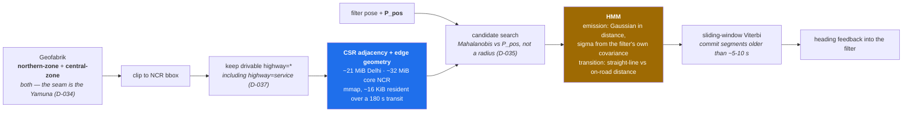

# maps/ — OSM graph & HMM map matcher

**Seat P.**

The outer correction layer. Map matching is what pushes cross-track error under 10% on curvy
tunnels — but it is deliberately **not** in the error budget allocation. It buys margin back; it is
not a term we plan to spend, because it does not exist in a car park.

## What lives here

- OSM `.pbf` extract → filtered drivable `highway=*` → compact **CSR** adjacency + edge geometry.
- Online HMM matcher: emission ∝ Gaussian in distance to candidate road; transition penalises the
  mismatch between straight-line and on-road route distance; Viterbi decode.
- Car-park fallback mode.

## Contract

**Emission σ comes from the filter's own position covariance — not from an assumed GPS noise model.**
This is the adaptation worth writing up: we already compute the uncertainty, so a matcher tuned for
raw-GPS noise is throwing information away. Use the filter's along-track distance for the transition
term as well.

**Sliding-window commitment.** Commit segments older than ~5–10 s; keep recent ones tentative.

**Heading feedback is an outer loop into the filter**, and it is one of the few things that bounds
yaw drift. Coordinate the interface with seat S.

## Library choice — **settled: build it, do not adopt one (D-036)**

Every candidate library takes GPS accuracy as **one scalar**. Valhalla Meili precomputes
`1/(2·σ_z²)` with `σ_z` defaulting to 4.07 m; FMM's `gps_error`, GraphHopper's
`measurement_error_sigma` and Barefoot's `sigma` are the same shape. That is the right model for a
raw GPS trace and the wrong one for a *filtered pose whose covariance we compute* — which is the
one adaptation in this layer worth writing up. Adopting a library means either discarding D-015 and
D-035 or patching someone else's core probability model.

| Rejected option | Why it was considered | Why not |
|---|---|---|
| **FMM / fast-map-matching** | C++/Python, precomputed UBODT, very fast | Scalar `gps_error` |
| **GraphHopper map-matching** | Java, `hmm-lib`, imports OSM directly, Android-friendly | Scalar `measurement_error_sigma` |
| Valhalla Meili | C++, tiled, mobile-oriented | Precomputed scalar `σ_z` |
| BMW Barefoot | Java, offline + online HMM, server-oriented | Scalar `sigma` |

Viterbi over the CSR is ~200 lines, and **the CSR is ours regardless** — its mmap behaviour is what
makes matching affordable on Android at all. Candidate search uses the Mahalanobis distance against
the filter's own `P_pos`, not a scalar radius (D-035): the 99% radius implied by the error budget
runs from **18 m at a 10 s outage to 359 m at 180 s**, a 20× span across the outage lengths the
protocol mandates, and the ellipse is anisotropic and rotates with heading.

**MapmyIndia/Mappls is not a screening dependency (D-041).** An online SDK behind an API key cannot
back a "100% offline" claim, and the measured offline footprint — ~21 MiB for the Delhi bbox,
~32 MiB for core NCR, ~16 KiB resident over a 180 s transit — removes the capability argument too.
Revisit it post-screening as a *rendering* layer only, never as the matching graph.

## Known failure modes

- **Flyover vs service road.** Indian OSM tagging is weakest exactly here, and this is the most
  likely map-matching failure in a Delhi demo. Heading consistency and barometer/road-slope help;
  lane-level matching needs a lane graph OSM rarely has, so stay at road level.
- **Parallel roads** — needs the transition model plus INS-heading vs road-bearing consistency.
- **Bad heading snaps confidently onto the wrong road**, converting a metric error into a
  categorically wrong answer. Map matching cannot rescue a trajectory whose yaw is already gone.

## Car-park mode

No road graph exists underground. Switch when GNSS is absent **and** no drivable OSM edge lies
within the position covariance ellipse. Then: tight NHC + barometer floor detection (a level ≈
2.5–3 m ≈ 0.3–0.36 hPa) + ramp detection from sustained pitch + loop geometry from gyro.

This is the hardest case and drift may exceed 10% on a long stay. Say so in the write-up.

## The pipeline, as designed

## Status

**Designed and sized; no code.** The extract sizing, the CSR layout and the matcher decision are all
recorded — D-034 (merge both Geofabrik zones), D-035 (Mahalanobis candidate search), D-036 (build,
don't adopt), D-037 (include `highway=service`), D-041 (no Mappls dependency).

**Deferred past screening** together with the Android app and car-park mode. The write-up presents
this layer as *design*, with D-035's covariance-driven candidate radius — 18 m at 10 s to 359 m at
180 s — as the argument for building a matcher rather than adopting one. That argument is worth a
slide with no matcher running.

Seat P's screening work is elsewhere and it is on the critical path: the **raw-strapdown INS** and
**GNSS-available** baselines. Gate 1 is defined as a *ratio between them*, so both must exist before
Gate 1, not alongside it. See [../docs/IMPLEMENTATION_PLAN.md](../docs/IMPLEMENTATION_PLAN.md) §6.

Extracts are gitignored — regenerate, never commit.
